# 在 Android 上做牙科 CBCT 三维测量与端侧 AI 分割：`:cbctmeasure` 模块实现拆解

> 这篇文章完整拆解一个 Android NDK 模块的实现：在体绘制（VTK）渲染的牙科 CBCT 上，做**临床级三维测量**（距离/角度/面积/体积/HU/骨密度）、**ROI 分割量化**、**种植体规划安全判级**、**端侧 ONNX 牙齿自动分割**，并把每个数字导出成 PDF 报告和 DICOM SR。
>
> 全文的技术结论都带**可复现证据**：主机侧 386 条断言、真机两轮回归（round5/round6）的 logcat 原文、AC-08 主机/真机逐元素比对，以及失败项（AI 精度未达门槛）的原始数字。凡是我没在真机或主机上跑出来的结论，都会写明是估计或未验证。
>
> 阅读门槛：会写 Android、看过 NDK/CMake 工程、知道 CBCT 是一张三维灰度体数据。医学背景不是必需的，我会把 HU、牙位、神经管这些概念在用到时解释清楚。

目录：

1. 需求边界：要做什么，验收口径是什么
2. 三层架构，以及「可在主机编译」这条硬边界
3. 拾取：屏幕上点一下，怎么变成三维坐标
4. ROI 体积为什么能做到 ≤1% 误差：体素角点权重
5. 种植体规划的红黄绿判定
6. 端侧 AI：从 265 MB 体数据到「每颗牙一条 ROI」
7. AC-08：怎么证明真机跑的模型和主机算的指标是同一个东西
8. 精度结论：F1 0.58，未达门槛，以及为什么不粉饰
9. 界面：为什么 AI 必须是 tab 而不是第二个 Fragment
10. 结果、归档、PDF 与 DICOM SR：三处输出必须同源
11. 真机回归方法论：坐标只信 dump，结论只信 logcat
12. 性能实测数据
13. 踩坑清单（14 条）
14. 已知限制与后续
15. 复现指南

---

## 1. 需求边界：要做什么，验收口径是什么

模块名 `:cbctmeasure`，它是同仓库 `:cbctdeal`（CBCT 体数据解析 + VTK 体绘制）的**上层扩展**：复用同一份体数据指针、同一个渲染窗口，在其上做测量与规划。需求来自一份 PRD，拆成六组：

| 组 | 编号 | 内容 |
|---|---|---|
| 三维测量 | M-01 ~ M-08 | 两点距离、三点角度、点到线、ROI 体积、ROI 面积、弧线长度、HU 采样、骨密度评估 |
| ROI 分割 | R-01 ~ R-06 | HU 阈值、空间盒、平面 + 勾画多边形、球面、组合 ROI（A op B op C）、**AI 掩膜 ROI**（Phase 2 新增） |
| 手术规划 | S-01 ~ S-10 | 种植体定位、安全色（红/黄/绿）、骨高度、骨宽度、神经管距离、多种植体间距，以及 4 种正畸量 |
| 标注 | A-01 ~ A-07 | 文字、线段、箭头、自由曲线、环形、MPR 截面标注、截图圈注 |
| AI 辅助 | AI-01 / AI-03 | 牙齿自动分割（ONNX Runtime 端上推理）、种植位点推荐（规则 + ML 混合） |
| 交付 | 持久化 / PDF / DICOM SR | 三份 JSON 归档、A4 报告、Comprehensive SR |

验收口径是这套东西能不能收工的依据，它决定了后面所有的设计取舍：

- **AC-01/AC-02/AC-03**：几何量对解析值的误差（距离、角度、面积相对误差 ≤1%）；
- **AC-04**：HU 采样误差 0 HU（必须是原始体素值，不许插值）；
- **PC-01**：单次测量计算 ≤50 ms；**PC-02**：叠加层不掉帧；**PC-03**：截图取证；**PC-04**：测量层内存增量 0；**PC-05**：AI 推理延迟 ≤5 s、体积增量 ≤80 MB；
- **AC-08**：主机侧算出的指标与真机推理结果**奇偶校验**通过；**AC-09**：DICOM SR 能被读回自校验。

其中 AC-08 是最"贵"的一条，它要求我们把整条 AI 链路做成可取证的东西，第 7 节会展开。

明确不做的两件事也写进文档，避免以后有人误以为漏了：**AI-02**（颌骨/神经管/气道等其它结构分割，缺各自的专家标注，S-05 仍靠手工描记）和 **AI-04**（AI 生成报告文字，属临床诊断输出，无可验证语料，刻意不做）。

---

## 2. 三层架构，以及「可在主机编译」这条硬边界

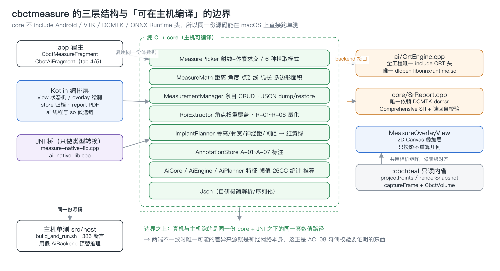

分层本身不新鲜：Kotlin 管 UI/编排/持久化/报告排版，JNI 桥只做类型转换，业务与几何计算全在纯 C++ core。真正有价值的是 core 的那条**硬约束**：

> `core/` 下的 `.cpp/.h` 不 include 任何 Android、VTK、DCMTK、ONNX Runtime 头文件。

它唯一的用处是让同一份源码能在 macOS 上直接 `clang++` 编译并跑断言：

```bash
cd cbctmeasure/src/host && ./build_and_run.sh
```

```
RESULT: PASSED 386 / FAILED 0 / FINDINGS 4
AC-01 最坏绝对误差 8.88e-16 mm · AC-02 7.11e-15 度 · AC-03 最坏相对误差 0.1244% · AC-04 0.000 HU
```

386 条断言覆盖 M-01~M-08 的解析值对照、R-01~R-06 的体积/面积/权重逐位一致、S-03~S-06 判级、S-07~S-10 正畸量、AI 组的掩膜 ROI 复用与归档往返、JSON 往返（值与单位不变）、`detailJson` 字段完备性，以及异常路径（点数不足 / ROI 不存在 / 组合 ROI 环引用）。

这里的 `FINDINGS 4` 不是失败，而是「实现与 PRD 字面表述不一致、但按更合理定义实现并写进了文档」的提示项。把这种差异做成机器输出而不是靠人记，是这套单测第二个值钱的地方。

### 2.1 AI 层也守这条线

AI 层最容易被写成一团「只有真机能跑」的代码。这里的做法是把**确定性路径**留在 core：

- `core/AiCore.cpp`：抽稀、6 通道特征、阈值、26 邻接连通域、质心/PCA 长轴/包围盒/轮廓、逐实例 HU 与体积；
- `core/AiEngine.cpp`：会话内编排（推理调用通过一个 `AiBackend` 接口注入）；
- `core/AiPlanner.cpp`：AI-03 候选生成；
- `ai/OrtEngine.cpp`：**全工程唯一** include ONNX Runtime 头、唯一 `dlopen` 运行时 `libonnxruntime.so` 的翻译单元。

于是主机单测可以用一个假 `AiBackend` 注入已知的 `prob`，把「阈值 → 连通域 → 实例 → 体积 → 掩膜 ROI → 归档」整条链在 macOS 上逐断言跑通，只有神经网络那一步是假的。`build_and_run.sh` 编译 `AiCore + AiEngine + AiPlanner`，**刻意排除 `ai/OrtEngine.cpp`**。

### 2.2 Debug 构型为什么要补 `-O2`（以及一个浮点陷阱）

AGP 传下来的是 `CMAKE_BUILD_TYPE=Debug`，NDK 工具链会把 `CMAKE_CXX_FLAGS_DEBUG` 置成空串，等于**不带任何 `-O`**。R-02 体积盒即使已有快速路径，145 万体素在 `-O0` 下 `analyze` 实测 73 ms，直接违反 PC-01 的 ≤50 ms。

```cmake
# -ffp-contract=off：clang 默认允许把 a*b+c 合并成 FMA，-O2 下会真的合并，
# 那样 AC-02 的均值/标准差与主机侧 -O0 单测就不是逐位可比了；关掉乘加收缩，
# 保证同一份体数据在真机与主机上得到完全相同的统计量。
target_compile_options(${CMAKE_PROJECT_NAME} PRIVATE
        -ffunction-sections -fdata-sections
        $<$<CONFIG:Debug>:-O2>
        $<$<CONFIG:Debug>:-ffp-contract=off>)
```

两个细节：

1. 必须用 **target 级** `target_compile_options`，它排在 `CMAKE_CXX_FLAGS_DEBUG` 之后才生效；在 Gradle 里写 `cppFlags("-O2")` 会被 Debug 构型的空串覆盖。
2. `-ffp-contract=off` 不是洁癖。开了 FMA 之后，真机（`-O2`）与主机（`-O0`）算出的 ROI 平均 HU / 标准差就不再逐位可比，AC-02 的浮点断言会莫名漂移——而且漂移量小到肉眼看不出，只会在跨端比对时爆掉。

作用域只有 `:cbctmeasure`，`:cbctdeal` / `:rawpixeldeal` / `:dcmtk` 的编译参数一字未动。真机对照过解析耗时（`1899/1908/1920/2064 ms` 同分布），渲染与像素算子行为零变化。改后 R-02 大盒 21~23 ms，R-03 单层截面 12 ms。

---

## 3. 拾取：屏幕上点一下，怎么变成三维坐标

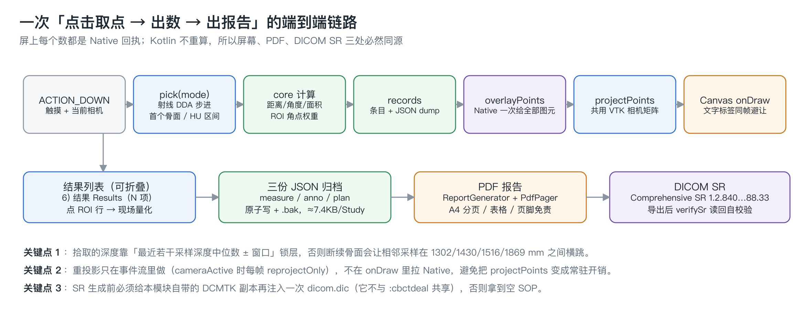

体数据指针由 `:cbctdeal` 的 `CbctVolumeHandle` 传入，`MeasureJni.bindVolume` 在 core 侧建一个 `VolumeRef`——**零拷贝引用**，不复制那 265 MB。所有测量都只带一个 `Long` 句柄在 JNI 之间来回。

拾取的输入是屏幕坐标 + 当前相机，输出是世界坐标（mm）。`MeasurePicker` 用射线与体素网格求交（DDA 式步进），参数集中在一个结构体里：

```cpp
struct PickRequest {
    int mode = 0;              // 0 骨面 / 1 穿透骨 / 2 HU 区间 / 3 MPR 平面 / 4 ROI 表面 / 5 神经管折线
    double huThreshold = 200.0;
    int skip = 0;
    double huLo = 200.0, huHi = 3000.0;
    int plane = MP_AXIAL;
    int planePosition = 0;
    int roiId = 0;
    int nerveId = 0;
    double toleranceMm = 2.0;
    /** 深度窗口（仅骨面拾取用，单位 mm，沿射线自相机原点计）：只在 [tMinMm, tMaxMm]
     *  内找第一个骨面。两者都为 0 表示不限 —— 保持"射线上第一个骨面"的原语义。 */
    double tMinMm = 0.0;
    double tMaxMm = 0.0;
};
```

`mode` 做成整数而不是「几个 bool + 一个 plane」的组合，是因为早期版本靠参数位置推断语义，真机上出现过「穿透拾取的 `skip` 被当成 `plane`」这种只有实机才能暴露的错值。

**深度窗口 `tMinMm/tMaxMm` 是拖动描记（M-06 弧线、A-04 自由曲线、A-05 环形）的关键。** 按住拖动采样时，如果每帧都取"射线上第一个骨面"，断续的骨面会让相邻采样的深度在 1302 / 1430 / 1516 / 1869 mm 之间横跳——投到屏幕上就是一条抖动的折线，弧长更是完全不可信。做法是维护最近若干次采样深度的**中位数**，把窗口锁在中位数 ± 一个容差内，等价于"在当前这个深度层附近描记"。

HU 采样（M-07）走 `VolumeRef::huAt`，取**体素中心的原始 int16 值**，不做三线性插值——AC-04 要求误差 0 HU，插值一次就不可能满足。部分容积效应是数据本身的性质，不是我们的测量误差，这条界线要在实现里划清楚。

---

## 4. ROI 体积为什么能做到 ≤1% 误差：体素角点权重

这是整个模块最值得展开的数值设计。

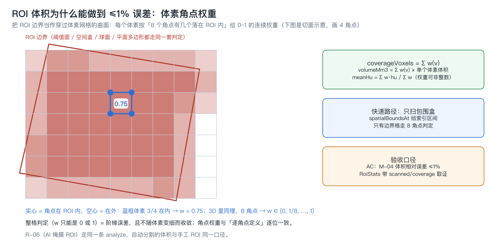

### 4.1 问题

ROI 的边界（阈值面 / 空间盒 / 球面 / 平面 + 多边形）是连续几何，体素网格是离散的。最直觉的实现是"体素中心在 ROI 内就算 1，否则算 0"，误差是**阶梯状**的：它不随体素变细而收敛，只是锯齿变密。`RoiExtractor.h` 里记着实测口径：

> 纯整数计数在球面/平面边界处误差可达 3%（半径 5 mm、体素 0.3 mm 时），不满足 PRD 的 ≤1%；角点加权后按中心极限估计降到 ~0.2%。

### 4.2 做法

把每个体素看成立方体，对它的 **8 个角点**分别做包含测试，落在 ROI 内的角点比例就是该体素的覆盖权重——等价于 2×2×2 超采样，但不引入任何新缓冲：

```cpp
case ROI_BOX:
case ROI_PLANE:
case ROI_SPHERE: {
    Vec3 center;
    vol.indexToWorld(i, j, k, center);
    const CornerWalker w = {center,
                            Vec3(vol.spacingX() * 0.5, vol.spacingY() * 0.5,
                                 vol.spacingZ() * 0.5)};
    if (roi.type == ROI_PLANE && planeHasContour(roi)) {
        // 单层门 + 面内角点加权
        const Vec3 nu = roi.planeNormal.normalized();
        if (std::fabs((center - roi.planeOrigin).dot(nu)) > slabHalfThickness(nu, vol))
            return 0.0;
        const int drop = dominantAxis(nu);
        int inPlane = 0;
        for (int n = 0; n < 8; ++n) {
            if (polygonContains2D(roi.polygon, w.corner(n), drop)) ++inPlane;
        }
        return (double) inPlane / 8.0;
    }
    int hit = 0;
    for (int n = 0; n < 8; ++n) if (geometryContains(roi, w.corner(n))) ++hit;
    return (double) hit / 8.0;
}
```

于是：

```
coverageVoxels = Σ w(v)
volumeMm3      = Σ w(v) × 单个体素体积
meanHu         = Σ w(v)·hu(v) / Σ w(v)      // 权重可非整数
```

R-03 的平面裁剪有个演进：最初只有"半空间切割"（法向点积），后来加了勾画多边形，变成**先过单层门、再在面内做角点加权**。少了多边形那一步，用户在切面上圈出的形状会被忽略，算出来的是整条切带的量——这是真机上被用户反馈抓到的。

HU 阈值（R-01）不参与角点加权，按体素中心判定：

```cpp
case ROI_HU_THRESHOLD: {
    Vec3 c; vol.indexToWorld(i, j, k, c);
    const float hu = vol.huNearest(c, -2000.0f);
    return (hu >= (float) roi.huMin && hu <= (float) roi.huMax) ? 1.0 : 0.0;
}
```

因为 HU 区间本身是逐体素的标量属性，对角点做插值反而是在伪造数据。权重模型最终是**空间几何权重 × HU 阈值权重**。

### 4.3 快速路径，以及一个被主机用例抓住的等价性缺陷

145 万体素全网格扫一遍是 73 ms 的来源。真正的优化不是 SIMD，而是**只扫包围盒**：`spatialBoundsAt` 把盒/球/平面多边形换算成体素索引区间，只有区间内的体素参与，且只有边界格需要走 8 角点判定。R-02 大盒从 73 ms 降到 21~23 ms。

快速路径的正确性靠一条主机等价用例守：

```
大盒 #7（coverage 1370246.5）与截面 #12（4 点、152.498 cm²）做交集，
得到的 coverage / 体积 / 平均 HU 与 #7 单独统计逐位相同 —— 相当于 B 没参与。
```

曾经写过一版"只比一边"的区间判定，在这条用例上直接崩了——非对齐盒的快速路径 coverage 与全网格不一致。这类 bug 在真机上表现为"某个 ROI 的体积看着差不多"，永远发现不了；在主机侧是一行断言失败。

### 4.4 R-06（AI 掩膜 ROI）是唯一的例外

AI 掩膜 ROI 的权重是 0/1，不做角点加权：

```cpp
case ROI_AI_MASK: {
    // R-06：整块抽稀掩膜单元归属判定（中心点属于该单元即权重 1）。
    // 掩膜比体素粗，亚体素超采样无意义。
    if (!ai) {
        if (error && error->empty()) *error = "AI 掩膜 ROI 需要推理结果（已清除或未运行）";
        return 0.0;
    }
    Vec3 c; vol.indexToWorld(i, j, k, c);
    return ai->containsMm(roi.aiLabel, c) ? 1.0 : 0.0;
}
```

原因是掩膜本身是在 1.2 mm 抽稀网格上产生的，而体素是 0.6 mm——在一个 8 倍体积的粗单元里做亚体素超采样，算出来的小数权重是假的精度。

关键是它**走同一条 `RoiExtractor::analyze`**：`AiMaskQuery` 是一个只有两个纯虚函数的接口（`containsMm` 世界坐标是否属于该实例、`boundsMm` 该实例的世界包围盒），由 `MeasurementManager` 实现并注入。于是 M-04 体积和 M-08 骨密度对 AI 掩膜和对手工 ROI 是**同一套代码、同一口径**，`boundsMm` 则让 R-06 也能吃到包围盒快速路径。

---

## 5. 种植体规划的红黄绿判定

S-02 要求"红=不安全 / 黄=临界 / 绿=安全"，但 PRD 只给了三个警告阈值（骨高 <10 mm、骨宽 <6 mm、神经管距离 <2 mm）。实现里临界带是推导出来的：

```cpp
const double ImplantPlanner::kMinBoneHeightMm = 10.0;
const double ImplantPlanner::kMinBoneWidthMm  = 6.0;
const double ImplantPlanner::kMinNerveDistMm  = 2.0;
const double ImplantPlanner::kMinSpacingMm    = 3.0;
const double ImplantPlanner::kMarginalFactor  = 1.2;   // 黄档 = [阈值, 阈值×1.2)

// 判级：取所有指标里最严重的一档
auto judge = [&](double value, double threshold) {
    if (value < threshold) level = std::max(level, (int) DANGER_RED);
    else if (value < threshold * kMarginalFactor) level = std::max(level, (int) WARN_YELLOW);
};
judge(boneH, kMinBoneHeightMm);
judge(boneW, kMinBoneWidthMm);
if (nerveOk)   judge(nerve,   kMinNerveDistMm);
if (spacingOk) judge(spacing, kMinSpacingMm);
```

`std::max(level, …)` 这个写法是有讲究的：多指标合成时取最严重的一档，而不是最后一条覆盖前一条。

三个几何量的定义：

- **骨高度**：沿种植体轴线自入口点向根端采样，找连续皮质骨（HU ≥ 骨阈值）的深度；
- **骨宽度**：入口截面颊舌向的骨宽；
- **神经管距离**：种植体轴线到神经管折线的最短距离**减去管道半径**（默认 1.5 mm，创建时自动切到 MPR 便于描记）——净距才是临床量，中心距会系统性偏乐观；
- **种植体间距**：两条轴线间距**减去两个半径**，即表面净距。

姿态用两个角参数化，基准方向 `(0,0,-1)`，先绕 X 转 pitch 再绕 Y 转 yaw（右手系）：

```cpp
Vec3 ImplantPlanner::axisFromAngles(double pitchDeg, double yawDeg) {
    const double p = MeasureMath::degToRad(pitchDeg);
    const double y = MeasureMath::degToRad(yawDeg);
    ...
}
```

任一种植体增删都会触发 `recomputePlan()` 全量回填，因为 S-06 的间距是**成对**量——只更新被改的那一条会留下过期的邻居判定。

`warningText()` 把未达标的项拼成人话（"骨高度不足 8.3mm（安全值 >= 10.0mm）; "），全达标时也要输出一句"各指标均在安全范围内（骨高 …/骨宽 …）"，并且在没勾画神经管时明确说明该项未参与判定。**没有神经管数据 ≠ 神经管安全**，这种话必须由程序说出来。

---

## 6. 端侧 AI：从 265 MB 体数据到「每颗牙一条 ROI」

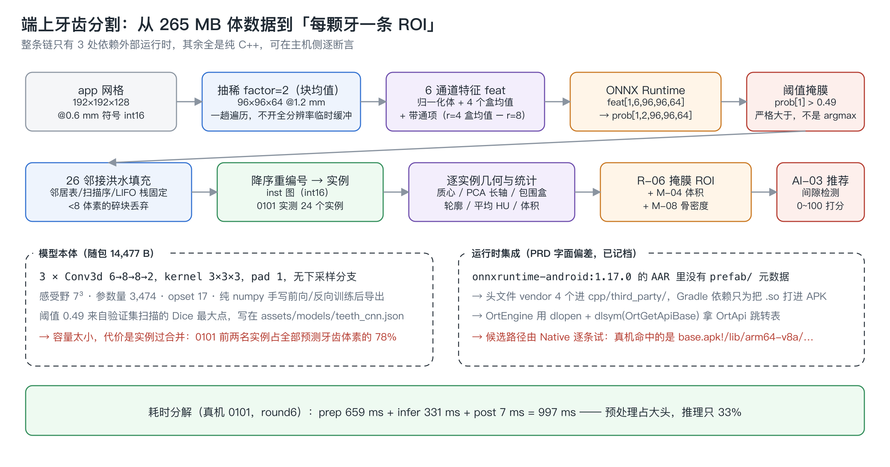

### 6.1 网格与抽稀

随包的牙科 CBCT 是 192×192×128 @0.6 mm 的符号 int16 序列（公开 DentVoxel 数据转成的 DICOM）。直接在这个分辨率上跑 3D 卷积，内存和延迟都超预算，所以先做 `factor=2` 的**块均值抽稀**：

```
grid: app 192x192x128@0.600 -> model 96x96x64 factor 2x2x2
```

抽稀到 96×96×64 @1.2 mm（589,824 个模型体素），一趟遍历完成，不开全分辨率临时缓冲。HU 归一化和抽稀同时做。

### 6.2 6 通道特征：把先验写进输入，而不是把网络写大

网络只有 3,474 个参数，所以特征工程承担了大部分表达能力：

```cpp
// 6 通道输入 = 归一化体 + 4 个盒均值 + (r=4 盒均值 - r=8 盒均值) 的带通项
void buildFeatures(const float *vol, const AiGrid &g, std::vector<float> &feat) {
    std::vector<float> c0;
    decimateNormalized(vol, g.appDim, g, c0);          // 通道 0：归一化体
    std::vector<float> boxes[4];
    for (int b = 0; b < 4; ++b) boxMean(c0, g, AiConst::BOX_RADII[b], boxes[b], tA, tB);
    // c5 = box(r=4) - box(r=8)：中程与长程对比之差（单牙尺度 vs 牙弓尺度）
    std::vector<float> band(redN, 0.0f);
    for (size_t t = 0; t < redN; ++t)
        band[t] = boxes[AiConst::BANDPASS_A][t] - boxes[AiConst::BANDPASS_B][t];
    ...
}
```

六个通道分别是：归一化体本身、四个不同半径的盒均值（多尺度平滑）、以及 r=4 与 r=8 盒均值之差这个**带通项**。带通项的物理含义是"这个体素在单牙尺度上比牙弓尺度更亮多少"——牙齿正是牙弓背景上的局部高亮块。把它显式做出来，等于让一个 3 层卷积不必自己学多尺度。

输出组装成 NCDHW（N=1）：`feat[c][i][j][k]`，抽稀未覆盖的模型网格高端区域补 0。

### 6.3 模型本体

```
teeth_cnn v2：3 × Conv3d 6→8→8→2，kernel 3×3×3，pad 1，无下采样分支
感受野 7×7×7 · 参数量 3,474 · opset 17 · 纯 numpy 手写前向/反向训练后导出
```

`feat[1,6,96,96,64] → prob[1,2,96,96,64]`，通道 0 是背景、通道 1 是牙齿。整个模型 14,477 字节。

### 6.4 阈值：来自数据，不来自代码

```cpp
const float *tooth = prob + n;      // 通道主序：c0=背景, c1=牙齿
for (size_t t = 0; t < n; ++t) {
    // 与主机 parity 脚本同一判据：prob[tooth] > threshold（严格大于，
    // 恰好等于阈值的体素归背景）。比较在 float 升到 double 后做，
    // 因为 threshold 是 double，若在 float 侧比较会在阈值附近抖动。
    if ((double) tooth[t] > threshold) { ... }
}
```

三个容易踩的点：

1. **不是 argmax**。0101 上 `prob[1] > 0.49` 与 `argmax(prob)` 差 133 个体素——因为两通道之和不为 1（没有 softmax 归一化约束时，`p1 > 0.49` 与 `p1 > p0` 不等价）。判据必须和主机侧脚本逐字一致，否则 AC-08 白做。
2. **比较在 double 侧做**。阈值是 `double`，如果先把 `threshold` 降到 float 再比，阈值附近的体素会随编译器和平台抖动。
3. **阈值 0.49 存在 `assets/models/teeth_cnn.json` 里**，是在验证集病例 0074 上扫出来的 Dice 最大点。代码里的 `AiConst::TOOTH_THRESHOLD` 只是 json 缺失时的回退值。改阈值应该改随包 json，而不是改代码——这样阈值就成了和数据一起演进的东西。

### 6.5 26 邻接连通域：可复现性优先于性能

```cpp
static const Neighbor26 nb;                 // 邻居表顺序固定
...
stackI.push_back(i0); ...                   // LIFO 栈（不是队列）
while (!stackI.empty()) {
    const int i = stackI.back(); ... stackI.pop_back();
    for (int q = 0; q < 26; ++q) {
        const int a = i + nb.d[q][0], b = j + nb.d[q][1], c = k + nb.d[q][2];
        if (越界) continue;
        if (r.label[s] == 0 || r.inst[s] != 0) continue;
        r.inst[s] = (short) raws.size();    // 边填边标记，天然去重
        stackI.push_back(a); ...
    }
}
if (count < AiConst::MIN_INSTANCE_VOXELS) { /* <8 体素的碎块丢弃 */ }
```

连通域本身是确定的，但**实例编号**要能被主机侧复现，所以邻居表顺序、扫描顺序、栈的 LIFO 性质、碎块丢弃阈值、以及"按裁剪后体素数降序重编号"全都固定下来。真机 0101 的结果：

```
thresholdMask: thr=0.4900 tooth voxels=9958 / 589824
connectedComponents: 24 instances
archAssign: occlusal z=61.17mm gap=15.95mm instances=24
```

有一个诚实的限制写进文档：C++ `std::sort` 非稳定，所以**尺寸并列的实例之间只保证多重集一致**，不保证编号一致。逐实例比对时按体素数排序，并列项按质心二次排序，但这条只能算工程约定，不是数学保证。

每个实例再算质心、二阶矩（PCA 长轴，用平行轴定理累加）、包围盒、轮廓、逐实例 HU 与体积。牙弓归属（上颌/下颌）由咬合面平面 `z=61.17 mm` 加 15.95 mm 间隙带判定。

### 6.6 运行时集成：PRD 写的是 Prefab，实际用的是 dlopen

PRD 的字面要求是"经 ONNX Runtime Android 集成"。实际拿到的 `onnxruntime-android:1.17.0` AAR **里没有 `prefab/` 元数据**，Prefab 这条路走不通。偏差记档在测试报告里，做法是：

- vendor 4 个头文件进 `cpp/third_party/onnxruntime/include/`（`onnxruntime_c_api.h` 等）；
- Gradle 依赖 `implementation(libs.onnxruntime.android)` **只为了把 `.so` 打进 APK**，CMake 只 include 头、不链接；
- `OrtEngine.cpp` 用 `dlopen` + `dlsym("OrtGetApiBase")` 拿 `OrtApi` 函数跳转表。

候选链在 Native 侧逐条试，因为"so 到底在磁盘上还是在 APK 里"取决于打包方式（`jniLibs.useLegacyPackaging` / `android:extractNativeLibs`），不是代码能假设的：

```cpp
// 三种形态都试：
//   a) nativeLibraryDir/libonnxruntime.so   —— 安装期解到磁盘，stat 能过
//   b) <apk>!/lib/<abi>/libonnxruntime.so    —— 原位映射，不是文件系统路径，
//      因此含 "!/" 或相对名一律跳过 stat，直接交给 linker 判定
//   c) libonnxruntime.so                     —— 走 app namespace 搜索路径
const std::vector<std::string> cands = soCandidates(soPath);
for (size_t i = 0; i < cands.size(); ++i) {
    const bool inApkOrRelative = (p.find("!/") != std::string::npos) || (!p.empty() && p[0] != '/');
    struct stat st;
    if (!inApkOrRelative && stat(p.c_str(), &st) != 0) { reasons += ...; continue; }
    s->handle = dlopen(p.c_str(), RTLD_NOW | RTLD_LOCAL);
    if (s->handle) { usedSo_ = p; LOGD("dlopen ok: %s", p.c_str()); break; }
    ...
}
```

真机命中的是第 (b) 种形态：

```
ORT so 候选（2 条，磁盘形态无）：.../lib/arm64/libonnxruntime.so | .../base.apk!/lib/arm64-v8a/libonnxruntime.so
dlopen ok: base.apk!/lib/arm64-v8a/libonnxruntime.so
模型 .../files/ai_models/teeth_cnn.onnx（14477 字节），运行时 so=...，ORT 1.17.0 api v17
```

拿 API 表时还有一段版本协商：头文件写的是 `ORT_API_VERSION=17`，设备上的 so 若更旧会返回 `nullptr`，所以从期望版本**往下**找两端都支持的最高版本（ORT 的 ABI 约定是低版本结构体是高版本的前缀）：

```cpp
for (uint32_t v = ORT_API_VERSION; v >= 1 && !s->api; --v) s->api = s->base->GetApi(v);
```

还有一条容易漏的：`dlopen` 成功但 `OrtGetApiBase` 缺失时，必须**无条件关掉已打开的 handle**，否则重试路径上句柄泄漏。

**失败面收敛**：`nativeLoadModel` 不抛异常，只回 `ok=false + error`；Kotlin 据此禁用 AI 按钮，一期的测量/ROI/规划/报告继续可用。AI 是可选层，不能因为它不可用把整个页面变成砖。

### 6.7 体积预算与 `abiFilters`

PC-05 的预算是 ≤80 MB。`libonnxruntime.so` 16,033,712 B + `teeth_cnn.onnx` 14,477 B = **16.05 MB**。`:app` 因此加了：

```kotlin
ndk { abiFilters += "arm64-v8a" }
```

否则每个额外 ABI 都要再带一份 ORT 运行时，预算立刻翻倍。这个约束写在 README 的构建章节里，因为它是"看起来和 AI 无关的 Gradle 开关"，很容易被人当成多余配置删掉。

### 6.8 逐牙自动测量：R-06 ROI 原位复用

`MeasurementManager::aiAutoMeasure()` 对每个实例建/复用一条 R-06 掩膜 ROI，挂上 M-04 体积与 M-08 骨密度，`note` 打成 `AiConst::AUTO_NOTE`：

```cpp
for (AiInstance &ins : ai_.instances) {
    if (ins.roiId != 0) continue;             // 已经落过库，别重复建
    // 按 aiLabel 认领列表里已有的同一颗牙的掩膜 ROI：恢复归档 + 重跑推理时，旧 ROI
    // 连同它的数值行都在（那些行因掩膜网格不入档而显示"待重算"）。不认领的话每跑一
    // 次就多一套 26 行，报告里双份条目且一半是空的。
    int reuseId = 0;
    for (RoiDef &r : rois_)
        if (r.type == ROI_AI_MASK && r.aiLabel == ins.id) { reuseId = r.id; break; }
    if (reuseId != 0) { roi.id = reuseId; updateRoi(roi); }   // id 不变，只刷新名称/配色
    else roiId = addRoi(roi);
    if (reuseId != 0) { /* 只清本函数自己写过的行（note == AUTO_NOTE）；先收集 id 再删 */ }
}
```

这条复用逻辑是被一个真实缺陷逼出来的：**掩膜网格不进归档**（96×96×64 的体素场会让"≤1 MB/Study"的预算直接爆掉），所以「恢复归档 → 重跑推理 → 再点逐牙自动测量」是常规路径。旧实现每次新建 ROI，结果列表翻倍，而且新行全部显示"待重算"——**这些失败行还会被原样写进临床 PDF**。真机复现过：PDF 里 26 条"待重算"。修完同一份 PDF 是 0 条，ROI 仍是 13 个。

三个细节：

- 删除顺序必须**先收集 id 再删**，否则 `erase` 时迭代器失效；
- 只删 `note == AUTO_NOTE` 的行，手工挂在同一条掩膜 ROI 上的测量不会被误删（有断言）；
- `AiConst::AUTO_NOTE` 这个字面量被主机用例钉住，因为改文案会让已归档的自动行认不出来，变成永远删不掉的孤儿。

`adoptAiResult` 是**按值拷贝**：`roiId` 只回填到 manager 内部那份副本，调用方手里的 `AiResult` 恒为 0——读回填值必须走 `mgr.ai()`。这种坑单靠 code review 抓不住，靠的是"复用了几条 ROI"必须打进日志：

```
aiAutoMeasure: 复用 ROI #67/#70（aiLabel=23/24），清理旧自动测量 2 条
24 实例 -> 48 条测量（R-06 掩膜 ROI 复用 M-04/M-08）
```

### 6.9 AI-03 种植位点推荐：ML 出先验，规则出判定

分工很明确：

- **ML** 提供解剖先验——牙弓归属、每颗牙的质心与长轴，全部来自 AI-01 的掩膜实例。**没有分割就没有候选**，缺牙间隙完全是从这些几何量推出来的；
- **规则** 提供判定——净间隙阈值筛缺牙位、邻牙长轴加权得植入轴向、牙槽嵴顶高度估计、按 S-03/S-04 实测骨量反选植体直径与长度、0~100 打分排序。

净间隙的定义值得抄下来，因为它否掉了一个看起来更简单的写法：

```cpp
// 净间隙 = 两牙质心距离 - 两侧包围盒在该方向上的投影宽度之半。
// 用投影宽度而不是固定牙冠宽度：掩膜包围盒是各向异性的（磨牙宽、
// 切牙窄），写死常数会把磨牙区的正常邻接误判成缺牙间隙。
const double gap = centerDist
        - 0.5 * (boxExtentAlong(A, tangent) + boxExtentAlong(B, tangent));
if (gap < minGapMm) continue;
```

配对只在**同一牙弓内排序后相邻的两个实例**之间做（`arches[a][t]` 与 `[t+1]`，排序键是牙位序号 `toothCountHint`，并列时再按弓内角度 `archAngleDeg`），`tangent` 取这两颗牙质心连线的方向——所以"间隙"是沿牙弓量出来的，不是全口两两最近距离。

打分权重写死并写进报告，便于复算与审阅：**骨高 35 / 骨宽 25 / 间隙 25 / 神经距离 15**；没有勾画神经管时该项给 5 分中性值（而不是 0 分，也不是满分）。真机上弹出的候选表（本地数据实跑，9 个候选，前 5 条）：

```
种植位点推荐（9 个候选）
AI-03: 9 个候选位，最高分 90（上颌）

上颌 18-6 间隙 42.8mm · 评分 90 · Ø5.0x13.0mm · 安全
  上颌缺牙间隙 42.8mm（AI#18↔#6）；骨高 19.5 / 骨宽 13.2 / 间隙下 HU 619；建议 Ø5.0×13.0mm

下颌 8-13 间隙 6.4mm · 评分 85 · Ø5.0x11.8mm · 安全
  下颌缺牙间隙 6.4mm（AI#8↔#13）；骨高 13.8 / 骨宽 8.4 / 间隙下 HU 1024；建议 Ø5.0×11.8mm

上颌 10-18 间隙 6.9mm · 评分 77 · Ø3.5x13.0mm · 不安全
  上颌缺牙间隙 6.9mm（AI#10↔#18）；骨高 21.6 / 骨宽 5.1 / 间隙下 HU 2000；建议 Ø3.5×13.0mm

下颌 12-16 间隙 5.7mm · 评分 62 · Ø5.0x6.0mm · 不安全
  下颌缺牙间隙 5.7mm（AI#12↔#16）；骨高 4.8 / 骨宽 11.4 / 间隙下 HU 1408；建议 Ø5.0×6.0mm；骨高不足，需植骨或改短桩

上颌 17-23 间隙 93.6mm · 评分 39 · Ø3.5x6.0mm · 不安全
  ...
```

每行的前半段是 Kotlin 拼的（`CbctAiFragment.kt:227`：`title() · 评分 · Ø直径x长度 · 安全等级`），后半段 `reason` 整句由 Native 的一条 snprintf 模板生成（`AiPlanner.cpp:209`）。所有**数值**——间隙、骨高、骨宽、间隙下 HU、建议规格、评分——都在 core 里算完再经 JSON 过桥，UI 只做格式化，所以这张表里没有一个是界面层算出来的。

三条值得注意的地方：

- **`AI#18↔#6` 是间隙两端的分割实例编号，不是牙位。** 看到它就该意识到这两"端"本身可能是被过合并的整块（0101 上 #1、#2 两个实例就占了全部预测牙齿体素的 78%），42.8 mm 这种明显超出解剖可能的间隙正是这么来的；最后那条 `AI#17↔#23` 的 93.6 mm 同理。UI 不做静默删除，而是把编号摊开让人自己排除——这正是第 8 节那条常驻免责文案存在的理由。
- **间隙下 HU 2000 会被照实显示。** 骨密度采样落在牙冠或金属伪影上就是会超生理范围，规则层不"修"这个数，评分照算，判级由 S-03/S-04 的实测骨量决定。
- **负间隙不会被丢掉**，而是在 `reason` 尾巴上写明"间隙为负（邻牙倾斜遮挡）"（`AiPlanner.cpp:216`）。

**采纳候选 = `SurgeryPlanJni.addImplant` + `recomputePlan`**，安全判级完全复用第 5 节的 S-02~S-06，不存在第二套数值。这是整个 AI-03 最重要的设计约束：AI 只能改变"建议放哪"，不能改变"这个位置安不安全怎么算"。

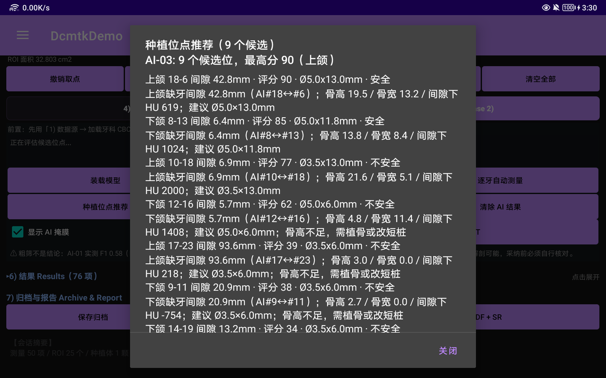

---

## 7. AC-08：怎么证明真机跑的模型和主机算的指标是同一个东西

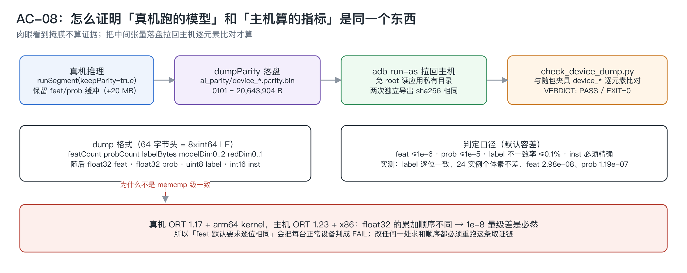

这条需求最初看起来像形式主义：主机侧用 numpy 算的 F1、Dice，凭什么代表真机上那个 `.so` 跑出来的结果？肉眼看到掩膜"像牙齿"不算证据。做法是把中间张量落盘，拉回主机逐元素比对。

### 7.1 取证格式

`AiEngine::dumpParity` 写一个自描述的二进制：

```
64 字节头 = 8 × int64 小端
  featCount, probCount, labelBytes, modelDim0..2, redDim0..1
随后：float32 feat · float32 prob · uint8 label · int16 inst
0101 合计 20,643,904 B
```

只有 `nativeRunSegment(threshold, keepParity=true)` 时才保留 feat/prob 缓冲（否则省掉约 20 MB），也就是说取证是显式动作，不常驻内存。

### 7.2 拉回与判定

```bash
ADB=$HOME/Library/Android/sdk/platform-tools/adb
$ADB shell run-as com.example.dcmtkdemo cat \
  files/ai_parity/device_dentvoxel_0101.parity.bin > /tmp/dcmtk_verify/device_0101.parity.bin
python3 cbctmeasure/src/host/ai/scripts/check_device_dump.py /tmp/dcmtk_verify/device_0101.parity.bin
```

`run-as` 免 root 读应用私有目录，这是 debug 包才有的能力，也是"取证不需要刷机"的前提。

判定口径（默认容差）：

| 张量 | 容差 | 实测 |
|---|---|---|
| `feat` | max\|diff\| ≤ 1e-6 | **2.980e-08**（799 个元素不同） |
| `prob` | max\|diff\| ≤ 1e-5 | **1.192e-07** |
| `label` | 不一致率 ≤ 0.1% | **逐位一致** |
| `inst` | 必须精确 | **24 实例个体素不差** |

结果 `VERDICT: PASS` / `EXIT=0`。round6 又独立导出了一次，两份 dump **逐字节相同**（sha256 前 12 位都是 `ddc22d9e5bb3`，20,643,904 B）——这排除了"偶然对上"。

### 7.3 为什么不是 memcmp 级一致（以及为什么容差不能设成 0）

真机跑的是 ORT 1.17 + arm64 kernel，主机夹具是 ORT 1.23 + x86。float32 的**累加顺序**不同，1e-8 量级的差是必然的。`feat` 那项容差曾经是 `0`（要求逐位相同），那份配置会把**每一台正常设备判成 FAIL**。所以：

> 判定口径是 "max|diff| + label 一致率"，不是逐字节相等。改任何一处求和顺序都可能让 AC-08 的夹具失效，改完必须重跑 checker。

这条已经写进 README 的"改动前请先读"章节，并在脚本参数旁留了注释防止下一个人手滑改回 0。

### 7.4 顺带被这条链抓出来的轴序问题

`feat[c][i][j][k]` 的 `i` 是 DICOM **列**、`j` 是 DICOM **行**、`k` 是 z（依据 `cbctdeal/CbctSeriesParser.cpp` 里 `vol->width = Columns` 与 `[depth][height][width]` 的布局）。**3×3×3 卷积对这个平面的转置不等价**（各向同性只在 1×1 或全对称时成立），所以模型必须按设备轴序训练**并且**按设备轴序导出；主机侧的 canonical 数组 `(rows, cols, z)` 要 `transpose(0,2,1,3)` 才能对上。

如果没有 AC-08 这条链，这个错误会表现为"F1 有点低但看起来能跑"——而实际上模型在横竖颠倒的数据上工作。

---

## 8. 精度结论：F1 0.58，未达门槛

AI-01 的 PRD 门槛是 Dice/F1 ≥ 0.85。实际在**未参与训练**的测试例 dentvoxel_0101 上：

```
F1 = 0.58285（阈值 0.49）
```

**未达标。** 这个数字直接印在测试报告标题、README 的需求覆盖矩阵，以及界面上常驻的免责读数里（截图最下方那行）：

> ⚠ 粗筛不是结论：AI-01 实测 F1 0.58（PRD 门槛 0.85）。掩膜常把相邻牙合并成一个实例，最大实例的「体积」要按牙组读；推荐的间隙候选可能超出解剖可能，采纳前必须自行核对。

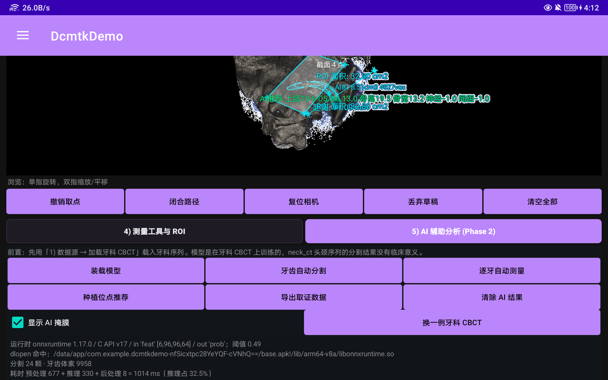

### 8.1 根因

可用标注数据只有 **2 例**（外加 1 例验证、1 例测试），模型只有 **3,474 参数**、没有多尺度分支。后果是**实例过合并**：0101 上前两名实例占全部预测牙齿体素的 **78%**。

这个缺陷在交付物上留了非常直观的痕迹。真机导出的 PDF 报告里，实例 #1 那一行是：

```
序号 77   ROI体积   AI 牙 L2(#1) 体积   8.471 cm3   ROI 1   AI-01 自动分割
```

一颗牙的体积在 0.3~1 cm³ 量级，8.471 cm³ 意味着这一条"实例"里装着好几颗牙。主机侧对同一例（0101）做过逐实例普查：#1 = 4,927 个 1.2 mm 掩膜体素 = **8.514 cm³**，与真机这行的 8.471 cm³ 差 0.5%。两者计数单位本就不同：普查按 1.728 mm³ 的掩膜单元数，R-06 按 0.216 mm³ 的 app 体素中心归属数，1 个掩膜单元对应 8 个 app 体素（0021 那条 12,587 掩膜体素的实例，设备上正好记成 `coverageVoxels=100696` = 12,587×8，是这层 1:8 关系的直接印证）。剩下 0.5% 落在实例边界的归属取整上，量级无关紧要，但没有逐体素复算过，就不假装已经解释干净。**能确定的是：这类实例的体积、骨密度、间隙都不具备单牙意义。**

### 8.2 为什么仍然把它做完并交付

因为交付的东西分两类，价值判断不一样：

- **推理链路、数据契约、取证口径**——这部分按 PRD 落地并通过（parity PASS、轴序依据记档、阈值来自数据、失败面收敛、R-06 与手工 ROI 同口径）。它是可复用的工程资产；
- **模型精度**——这是一个数据量问题，不是链路问题。2 例标注数据训不出 0.85，写多少代码都训不出来。

所以正确的处理是：把链路做扎实，把精度数字和成因如实写出来，把"这个结果只能当粗筛"这句话放到用户每次都会看到的位置。**把没达标的东西包装成达标，是这类项目里最贵的一种错误。**

---

## 9. 界面：为什么 AI 必须是 tab 而不是第二个 Fragment

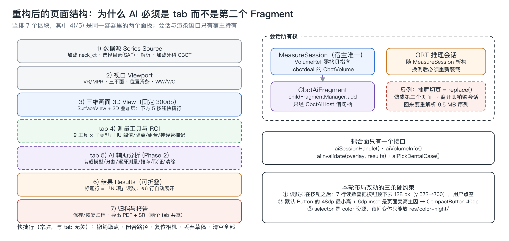

这一轮重构的需求是"把 AI 辅助分析剥离到另一个 fragment"。剥离之后有两种做法：抽屉里的第二个页面，或者同一个页面里的第二个面板。**选了 tab，理由是会话所有权。**

`:cbctmeasure` 的宿主页面持有 Native 会话（`MeasureSession`）和 VTK 渲染窗口。而抽屉切页用的是 `FragmentTransaction.replace()`——如果 AI 面板是第二个 Fragment，**离开页面就会把会话和渲染窗口一起销毁**，回来要重新解析那 9.5 MB 的 DICOM 序列（解析实测 222 ms，加上体数据重建更久），用户视角就是"看一眼 AI 结果，回来数据没了"。

所以实现是：

```kotlin
// CbctMeasureFragment 是 MeasureSession 与渲染窗口的唯一所有者
childFragmentManager.add(R.id.fl_ai_panel, aiFragment, "ai")   // 只 add，不 replace
// tab 切换只改 visibility
```

耦合面只有一个接口，四个方法：

```kotlin
interface CbctAiHost {
    fun aiSessionHandle(): Long          // 借 Native 会话句柄
    fun aiVolumeInfo(): ...              // 借体数据规格
    fun aiInvalidate(overlay: Boolean, results: Boolean)   // 通知重绘/刷新列表
    fun aiPickDentalCase(): ...          // 反向请求换病例
}
```

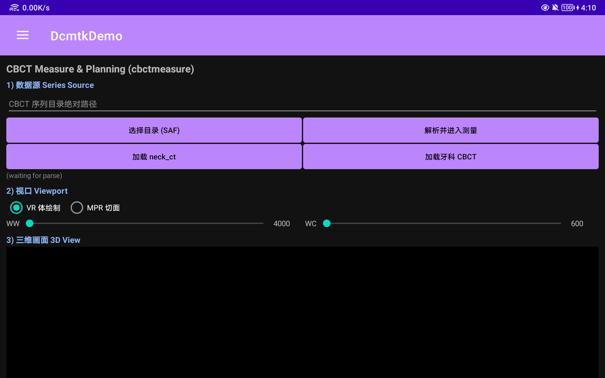

AI 面板切过去之后是这样：顶部两枚 tab 就是同一页内的两个面板，「装载模型」以外的按钮在模型未装载时全灰（点了也没意义，但保留可发现性），状态文本排在按钮之下，最底部那行黄字是常驻免责文案（第 8 节引的原文就是它）。

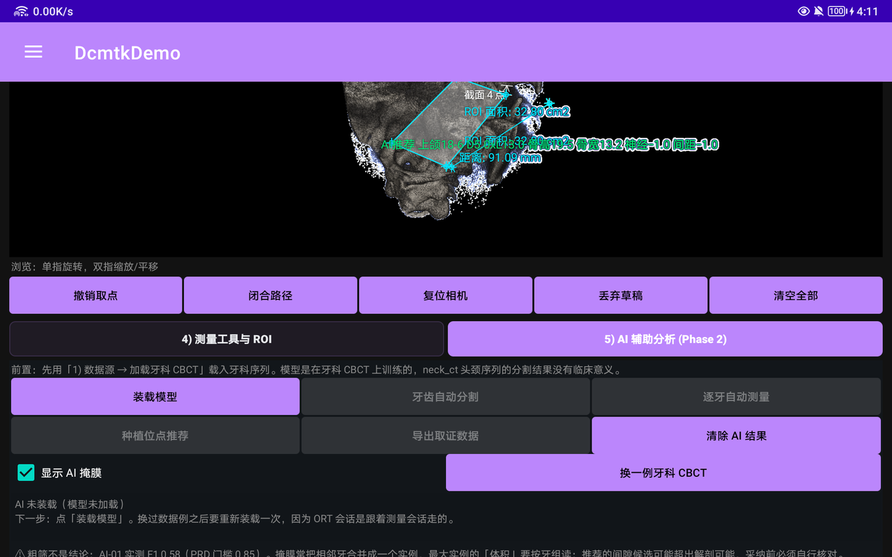

### 9.1 三条从真机上带回来的硬约束

这一轮改了 7 项 UI/提示缺陷（D-01~D-07），其中 3 条变成了布局纪律：

**① 读数必须排在按钮之后。** 最初 `tv_ai_status` 在按钮上方，`minLines=3` 只预留 3 行。点完「牙齿自动分割」，状态合法地变成 7 行，把整排按钮往下推了 128 px（`btn_ai_measure` 从 y=572 跳到 y=700），用户按上一个位置的手势点空。修复是把状态文本移到按钮与禁忌提示之下，回测逐位复验：分割前后 `btn_ai_measure` 都在 y=854。

**② 默认 `Button` 的 48 dp 最小高度 + 6 dp 内缩是页面变高的主因。** 统一换成 `CompactButton`（40 dp 高、12 sp、零 inset）后，原来 4 行的 ROI/神经管操作压成 2 行，WW/WC 与 HU 上下限各合成 1 行。

**③ `selector` 是 color 资源，夜间变体只能放 `res/color-night/`。** 放 `res/values-night/` 里的 `tab_text.xml` 不会生效，结果是夜间模式下 tab 文字与背景同色、完全看不见——这个 bug 只在夜间模式下出现，白天回归永远发现不了。

### 9.2 结果列表可折叠

`6) 结果 Results` 的标题行就是读数（"78 项"），`AUTO_COLLAPSE_ROWS = 6`：条目 ≤6 行自动展开，超过则自动收起一次；一旦用户手动点过（`resultsUserToggled = true`），就不再自动改他的选择。

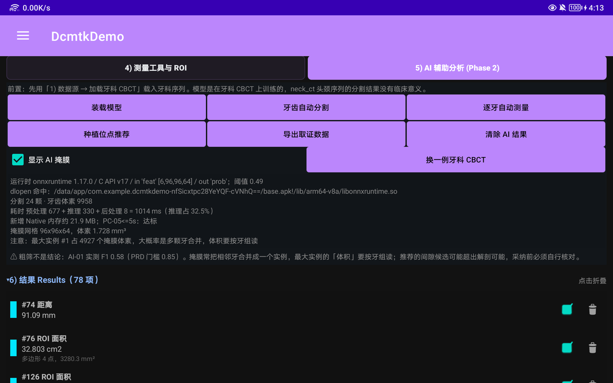

### 9.3 状态提示的两处呈现

叠加层会把当前操作提示画在画面左上角（`#00E5FF`，10 dp/20 dp），页面下方还有一个同样的 TextView。看起来"重复"，但这是刻意的：操作时眼睛在画面上，不需要为了知道"下一步点几下"而把视线移到面板。

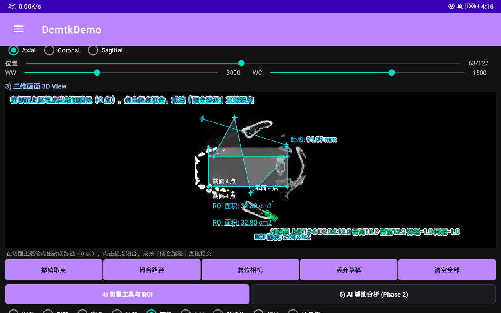

提示语的措辞按真机反馈改过几轮，现在每条都带**下一步动作**：

```
在切面上逐笔点出封闭路径（0 点），点击起点闭合，或按「闭合路径」直接提交
闭合无效：还需 2 个点（当前 1 点）
闭合无效：先在切面上点出至少 3 个点
未拾取到点：请对准骨面或切面再点击
AI 未装载（模型未加载）。下一步：点「装载模型」。换过数据例之后要重新装载一次，因为 ORT 会话是跟着测量会话走的。
```

最后一条里的"换例必须重新装载"是 D-01 的根因：换病例后旧推理结果与新体数据不匹配，界面上必须说清楚为什么按钮变灰，而不是让用户以为是程序卡住。

### 9.4 面积多边形的「闭合路径」

面积（M-05）原来只能"逐笔点 ≥3 点，再点回起点闭合"。真机上起点是个像素级的小目标，点不中就一直闭合不了。加了常驻按钮「闭合路径」，不依赖命中起点：

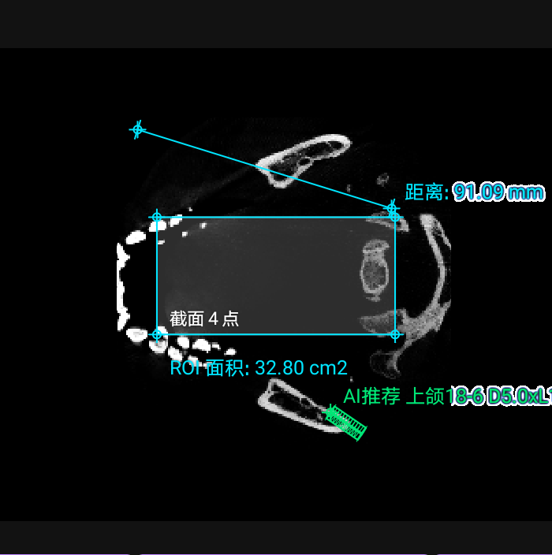

边界也处理了：只有 1 个点时点闭合，提示"闭合无效：还需 2 个点（当前 1 点）"，草稿不被吞掉。

---

## 10. 结果、归档、PDF 与 DICOM SR：三处输出必须同源

### 10.1 叠加层的数据来源

叠加层不在 Kotlin 侧重算几何。Native 一次返回所有图元（`overlayPoints / overlayJson`），Kotlin 只做投影：

- `CbctVtkJni.projectPoints(handle, world[])`：世界坐标 → 屏幕坐标，与体绘制**共用同一相机矩阵**，所以叠加能像素级对齐；
- `CbctVtkJni.renderSnapshot(handle)`：取 surface 尺寸与相机状态；
- `CbctVtkJni.captureFrame(handle)`：GPU 读回当前帧，供截图取证与 A-07 截图圈注。

重投影只在事件流里做（`cameraActive` 时每帧 `reprojectOnly()`），**不在 `onDraw` 里拉 Native**：VTK 在自己的渲染线程出帧，重投影与相机最多差一帧，又不会把 `projectPoints` 变成常驻开销。

文字标签在同帧里做避让（多条目时能看出仍有重叠，这是已记录的 D-07，只做到部分改善）。

### 10.2 三份 JSON 归档

```
filesDir/measurements/{StudyUID}_{SeriesUID}_measure.json   (+ .bak)
filesDir/annotations/ …_anno.json                            (+ .bak)
filesDir/plans/       …_plan.json                            (+ .bak)
```

原子写 + `.bak` 备份，实测约 7.4 KB/Study。`getExternalFilesDir()` 在个别机型返回 null，`StorePaths.external()` 会退回内部存储并打日志——避免"点导出没反应"这种静默失败。

### 10.3 PDF：canvas 绝对不能跨页缓存

这是整个项目里最凶的一个坑，值得单独讲。

`PdfPager` 里如果这样写：

```kotlin
val cc = canvas          // 拿到当前页的 canvas
...
ensure(need)             // 里面可能 newPage() → finishPage() 上一页
cc.drawText(...)         // 崩
```

一旦换页，就会对**已经 `finishPage()` 的页**继续绘制——它的 native `SkCanvas` 已经销毁，Java 侧持有的就是野指针，直接 SIGSEGV：

```
崩在 libhwui android::Canvas::drawText+300，fault addr 0x8
```

而且崩在协程线程上，Kotlin 的 `try/catch` 拦不住。最阴的地方是：**数据少时永远不换页，小报告导出一切正常**；条目一多、某段文本正好压到页底就必崩。

约定是所有绘制统一走 `surface(need)`：

```kotlin
/**
 * 必须在返回之后立刻落笔、不得把返回值存到下一次 ensure 之前再用：
 * 换页会销毁上一页的 native canvas，跨页使用即野指针。
 */
private fun surface(need: Float): Canvas? {
    ensure(need)
    return c()
}
```

即"取到就画完"。这条纪律的验证不是"导出成功"四个字：修复后连导三次都返回 `pdf=true pages=2 sr=true verify=true`，并且**拉回主机的 PDF 第 2 页内容流里数到 77 个文本算子**——这才证明"换页之后继续写字"那条路径真的被执行过且没崩。只测单页小报告的话，这条路径一次都不会走到。

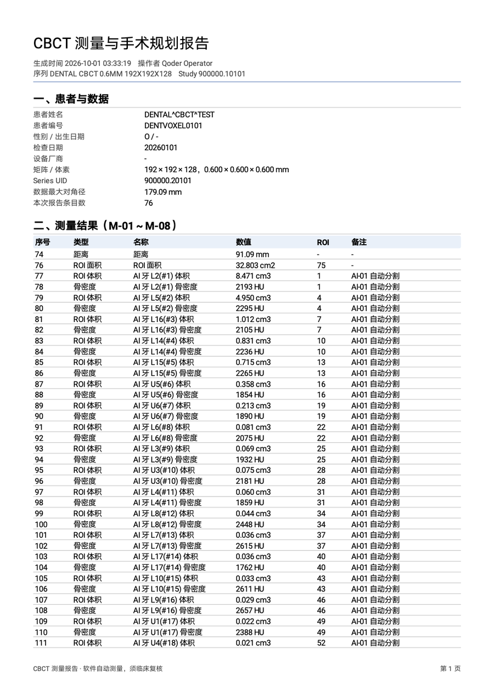

（截图里"序号"列从 74 开始不是排版错误：该列取的是条目 id `r.id`，不是行号。）

### 10.4 DICOM SR：最容易漏的一步

SR 导出用 DCMTK 的 `dcmsr`，输出 Comprehensive SR（`1.2.840.10008.5.1.4.1.1.88.33`），并且**导出后现场用 `ReportJni.verifySr` 读回自校验**，不依赖主机上的 `dsr2xml`。

坑在于字典：本模块自带一份独立的静态 DCMTK 副本，它的字典**不与 `:cbctdeal` 的 `libcbct_native.so` 共享**。所以 `ReportExporter.ensureDictionary()` 必须按本 `.so` 再注入一次（复用 `:cbctdeal` 已释放到 `filesDir/dicom.dic` 的文件）。**导出 SR 前不注入字典，会得到一个空 SOP**——而且它不报错，只是内容空。这是整个模块"看日志也看不出问题"的那类缺陷。

---

## 11. 真机回归方法论：坐标只信 dump，结论只信 logcat

两轮回归（round5 全量 + round6 逐条回测 R1~R16）用的是一套固定流程，几条纪律值得单独说：

**① 坐标只能来自当次 `uiautomator dump` 的节点 bounds。** 严禁按截图像素估算点击位置——截图含状态栏缩放和 density 换算，估出来的点会**静默点空**，而点空没有报错，只会表现为"界面没反应"，于是被误判成 bug。任何 swipe/滚动/弹窗之后必须重新 dump，同一个按钮在滚动前后 bounds 不同。只用 `clickable="true"` 的节点；父容器 bounds 常常铺满全屏，点它中心会落到别的控件上。

**② 解析 dump 用脚本，不用 grep。** uiautomator 的输出是单行巨型 XML，`grep -o` + `sed` 抽属性的字段顺序不稳定，历史上多次因此取错值。

**③ 判定看 logcat TAG，不看肉眼截图。** 每个数值断言都能在日志里找到对应行：

| TAG | 层 | 看什么 |
|---|---|---|
| `CbctMeasureCtrl` | Kotlin view | 状态机切换、拾取失败原因 |
| `CbctMeasure` | JNI | 方法注册、字符串转换 |
| `CbctMeasureCore` | C++ core | `analyze` 的 `scanned/coverage/vol/mean/in N ms`、`runSegment ok: inst=… prep/infer/post/total ms alloc=…`、`aiAutoMeasure: 复用 ROI #N（aiLabel=…）` |
| `CbctMeasureAi` | Kotlin ai + C++ `OrtEngine` | `ORT so 候选（…）`、`dlopen ok: <命中路径>`、`ORT 就绪：in='feat' 原始shape[…]` |
| `CbctMeasureOverlay` | Kotlin view | PC-02：`overlay fps=… avgDraw=…ms prims=…` |
| `CbctMeasureView` | Kotlin view | PC-03：`captureEvidence WxH frame=… overlay=… total=…` |
| `CBCT_MEASURE_STORE` / `CBCT_MEASURE_REPORT` | Kotlin | `saveAll/loadAll ok=x/3`、`report ok pages=…` |

例如"拾取到底命中没有"，肉眼在 1920×1200 的画面上判断不了，日志可以：

```
pick ... hit=true plane(0,63) at voxel(159,119,63)=253HU
```

**④ 截图编号存档，产物用 `run-as` 拉回主机离线读。** 判定"写进去的值对不对"要靠 `pydicom`/`dcmdump` 读回文件，而不是界面上显示了什么。

**⑤ 没有真机证据不宣称验证通过。** 这条听起来像口号，但它的可操作版本是：每个"通过"都必须能指到一行日志或一个文件。反过来，有些东西 adb 测不了——比如帧率，adb 注入事件的节奏不代表人手，所以 PC-02 的结论只报 `avgDraw` 毫秒数，不报 fps。

### 11.1 一个反直觉的缺陷：粘性提示

D-02 是这类回归里最常见的"看起来是 bug 其实是用例设计问题"：连续 3 次点空之后提示停在 `当前切面未拾取到点`，用户以为程序卡住了。根因是 `stickyMissHint` 只在手指按下（`ACTION_DOWN`）时才清，而"丢弃草稿"是**按钮**，不是画面上的 DOWN，所以残留提示没被冲掉。修复是在按钮路径里显式 `stickyMissHint = null; updateHint()`：

```kotlin
/**
 * stickyMissHint 也要一起清：它是"上一次没点中"的残留提示，只在手指按下时才会被冲掉，
 * 而按钮不是 view 上的 DOWN。
 */
```

同类问题在其它模块也会遇到：**任何"由代码触发的状态切换"，都要检查是否绕过了只响应触摸事件的清理路径。**

---

## 12. 性能实测数据

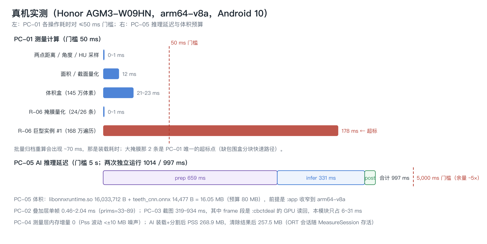

设备 Honor AGM3-W09HN（arm64-v8a，Android 10，1920×1200 横屏）。

| 项 | 实测 | 门槛 / 说明 |
|---|---|---|
| PC-01 两点距离 / 角度 / HU 采样 | 0~1 ms | ≤50 ms |
| PC-01 面积 / 截面量化 | 12 ms | ≤50 ms |
| PC-01 体积盒（145 万体素） | 21~23 ms | ≤50 ms（`-O0` 时是 73 ms） |
| PC-01 R-06 掩膜量化（24/26 条） | 0~1 ms | 走包围盒快速路径 |
| **PC-01 R-06 巨型实例 #1** | **178 / 162 ms** | **超标**：0021 那个被合并出的实例，遍历 1,686,672 / 覆盖 100,696 体素（遍历量是覆盖量的 ~17 倍），是 PC-01 唯一未达标的两项 |
| PC-02 叠加层单帧 | avgDraw 0.46~2.04 ms（prims 33~89） | fps 无法用 adb 注入验证，只报毫秒 |
| PC-03 截图取证 | 319~934 ms | 大头是 `:cbctdeal` 的 GPU 读回，本模块只占 6~31 ms |
| PC-04 测量层内存增量 | 0（Pss 波动 <±10 MB 属噪声） | 归档 ≈7.4 KB/Study |
| PC-05 AI 全链路 | 1014 ms（prep 676.8 / infer 329.6 / post 7.5）、997 ms（prep 659 / infer 331 / post 7） | ≤5 s，余量 ~5×；两次 `inst=24 toothVox=9958` 完全一致 |
| PC-05 体积 | 16.05 MB | ≤80 MB，前提是 `abiFilters arm64-v8a` |
| PC-05 分配 | `alloc=21.9MB` | `keepParity=false` 时省掉约 20 MB |
| 内存 | AI 装载 + 分割后 PSS 268.9 MB → 清除结果后 257.5 MB | ORT 会话随 `MeasureSession` 存活，"清除 AI 结果"不释放会话 |
| 冷启动 | `am start -W TotalTime` 1626 ms（round6），热启动 150/143 ms | 同一 APK，抖动主要来自系统侧 |
| 序列解析 | 222 ms | 9.5 MB / 128 张 |

两个诚实的补充：

- **预处理占 2/3，纯推理只占 1/3。** 优化方向是抽稀和盒均值，不是换更快的模型——这个结论只有把 `prep/infer/post` 分开计时才拿得到。
- **巨型实例那 178 ms 是真缺陷，不是测量噪声。** 包围盒快速路径对 R-06 是生效的（`ROI_AI_MASK` 走 `boundsMm` 取候选区间，见第 4 节），但这一条实例的包围盒本身就几乎横跨半个牙弓：168 万遍历体素里只有 10.07 万真的属于它，**遍历量是覆盖量的 ~17 倍**，而其余 24 条的遍历量只有 480~9,180。报告里给的缓解手段写的是"按实例包围盒分块 + 只扫非零体素"，本轮如实记为超标遗留项，没有因为它"只出现在过合并实例上"就当没问题——同一行数字在临床上也不该被采用，超标和不可信是 over-merging 这一个根因的两个表现。

---

## 13. 踩坑清单（14 条）

1. **NDK 的 Debug 构型等于 `-O0`**，`cppFlags("-O2")` 会被 `CMAKE_CXX_FLAGS_DEBUG` 覆盖；必须用 target 级 `target_compile_options($<$<CONFIG:Debug>:-O2>)`。
2. **`-O2` 会引入 FMA**，让真机与主机的浮点统计不再逐位可比；跨端比对必须 `-ffp-contract=off`。
3. **`PdfPager` 的 canvas 不能跨 `ensure()` 持有**，换页即销毁 native canvas，跨页绘制是野指针 SIGSEGV，且 Kotlin 拦不住。
4. **`color` selector 的夜间变体只能放 `res/color-night/`**，放 `values-night/` 不生效。
5. **每个自带 DCMTK 副本的 `.so` 都要单独注入 `dicom.dic`**，否则 SR 导出得到空 SOP，而且不报错。
6. **`getExternalFilesDir()` 在个别机型返回 null**，要退回内部存储并打日志，否则表现为"点导出没反应"。
7. **`std::vector::erase` 循环里不能边遍历边删**，先收集 id 再删。
8. **按值拷贝的"结果对象"上的回填字段是无效的**：`adoptAiResult` 把 `roiId` 写进了副本，读它必须走 manager。
9. **ONNX Runtime AAR 不一定有 `prefab/`**，别假设 Prefab 可用；`dlopen` 候选链要覆盖磁盘形态、`base.apk!/lib/...` 形态和裸名，且含 `!/` 或相对名要跳过 `stat`。
10. **`dlopen` 成功但符号缺失时必须 `dlclose`**，否则重试路径泄漏句柄。
11. **3×3×3 卷积对 (rows, cols) 转置不等价**，主机与设备的轴序必须显式对齐（`transpose(0,2,1,3)`），否则精度掉了一脸还找不到原因。
12. **`prob[1] > thr` 与 `argmax` 不等价**（0101 差 133 体素）；阈值比较要在 double 侧做。
13. **UI 上的"常驻读数"不能排在交互按钮之前**——行数变化会推走按钮；`minLines` 预留挡不住合法变长。
14. **A/B 截图对比要先确认"同一页面 + 同一滚动位置"**，否则会把滚动位移、选中背景条、状态栏时钟当成算法回归。

---

## 14. 已知限制与后续

- **AI-01 精度未达 PRD 门槛**（F1 0.58 vs 0.85）。改进路径按性价比排序：扩标注数据（>20 例）→ 加多尺度/更深分支治过合并 → 阈值重标。当前定位是"粗筛"，界面常驻免责读数。
- **R-06 巨型实例量化 178/162 ms 超 PC-01**：外层包围盒已经有了，还缺"按实例包围盒分块 + 只扫非零体素"这一层裁剪。
- **叠加层多条目时文字标签仍会重叠**（D-07 只部分改善）。
- **掩膜网格不入归档**，恢复归档后需重跑一次推理；R-06 ROI 会原位复用，不产生双份。
- **AI-02 / AI-04 未交付**，原因见第 1 节。
- 正畸量 S-07~S-10 走同一套测量通道，`MeasureType` 里独立存在，因此能进列表、归档与报告；但它们的临床解释仍依赖医师判断，模块只保证数值口径。

---

## 15. 复现指南

```bash
# 1) 构建宿主 APK（依赖已在本机缓存时加 --offline 更快）
./gradlew :app:assembleDebug --offline

# 2) 真机安装
ADB=$HOME/Library/Android/sdk/platform-tools/adb
$ADB install -r app/build/outputs/apk/debug/app-debug.apk
$ADB shell am start -n com.example.dcmtkdemo/.activity.MainActivity

# 3) 主机侧纯 C++ 单测（不需要设备，不需要 VTK/DCMTK/ONNX Runtime）
cd cbctmeasure/src/host && ./build_and_run.sh

# 4) 主机侧重建 AI 夹具与指标
#    输入默认取 ../raw（换目录：DENTAL_SRC=/path），产物默认写回 host/ai（换目录：AI_BUILD=/tmp/out）
#    SKIP_TRAIN=1 只重建夹具/报告、不动模型
cd cbctmeasure/src/host/ai/scripts && ./run_all.sh

# 5) AC-08：拉回真机 dump 逐元素比对（PASS 才允许宣称主机/真机一致）
$ADB shell run-as com.example.dcmtkdemo cat \
  files/ai_parity/device_dentvoxel_0101.parity.bin > /tmp/dcmtk_verify/device_0101.parity.bin
python3 cbctmeasure/src/host/ai/scripts/check_device_dump.py /tmp/dcmtk_verify/device_0101.parity.bin
```

驱动界面时记住：坐标取自当次 `uiautomator dump` 的 bounds 中心，判定看 logcat TAG，产物用 `run-as` 拉回主机离线读。

---

## 结语

这个模块真正花时间的地方，不是"把测量算出来"，而是**让每个数字可被质疑**：

- 几何精度靠"core 不含任何平台头文件"换来了主机侧 386 条断言；
- 跨端一致靠 `dlopen` 之外的 64 字节头和逐元素比对，以及一条"容差不能设成 0"的纪律；
- 临床可用性靠把"AI 没达标"这句话写进界面、写进 PDF 页脚（"CBCT 测量报告 · 软件自动测量，须临床复核"）；
- 性能靠一个 `-O2` 和一个包围盒快速路径，以及承认那两项还在超标。

如果这篇文章只留下一条经验，我会选这条：**把验收口径变成机器能跑的东西，剩下的都是工程细节。**
