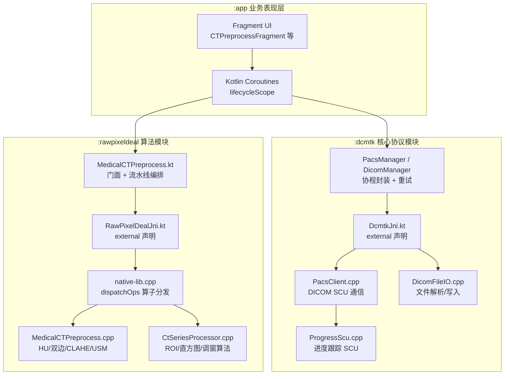
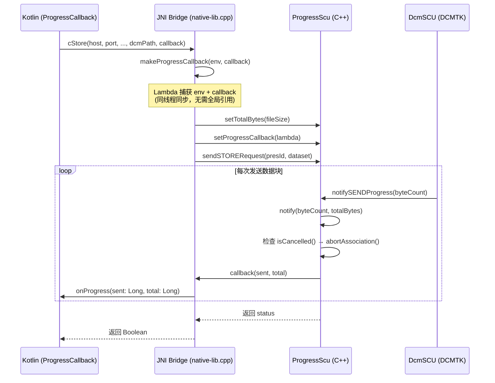
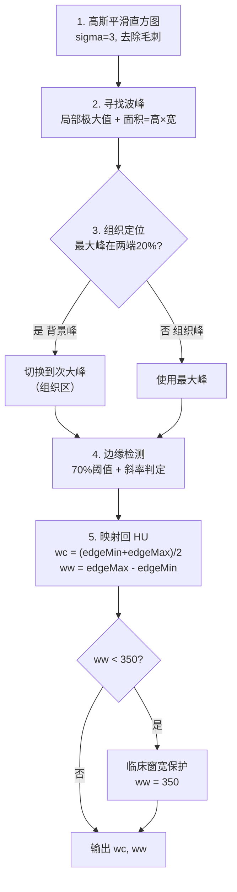
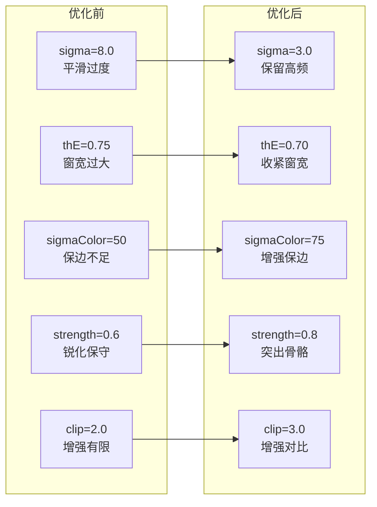
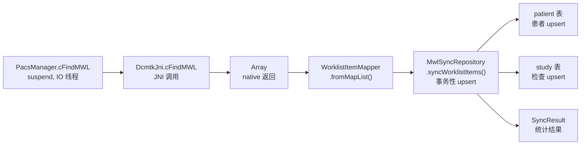

# DcmtkDemo 技术解析 Android 医学影像处理全栈方案

> 从 PACS 网络通信、DICOM 文件解析到 C++ 级像素预处理——逐层拆解一个在移动端实现桌面级医学影像能力的开源项目

**技术栈**：DCMTK + OpenCV 4.x · JNI / NDK · Kotlin Coroutines · C-ECHO / C-FIND / C-STORE / C-GET / C-MOVE

**项目仓库**：[github.com/wangyongyao1989/DcmtkDemo](https://github.com/wangyongyao1989/DcmtkDemo)

---

## 目录

1. 项目概述与架构总览
2. JNI 桥接层设计哲学
3. PACS 网络通信全解
4. DICOM 文件 I/O 实现
5. Kotlin 业务编排层
6. 医学图像预处理算法
7. 智能调窗算法深度解析
8. Mat 地址链式传递与内存优化
9. 工程优化实战：FT46 探测器调参
10. MWL 同步落库机制
11. 总结与展望

---

## 01 项目概述与架构总览


DcmtkDemo 是一个专为 Android 平台设计的医疗影像处理示例项目。它将复杂的 DICOM 通信协议和重度图像算法下沉到 Native 层，在移动端实现了接近桌面级的医学影像处理能力。项目集成了 **DCMTK**（DICOM Toolkit）和 **OpenCV 4.x**，覆盖了从 PACS 网络通信、DICOM 文件解析到高性能底层像素预处理的全链路功能。


整个项目由三个 Gradle 模块构成，各司其职、层次分明：


**MODULE :app — 业务表现层**

Fragment 驱动的 UI 界面、权限管理、基于协程的异步调用编排。包含 CT 预处理、上传、查询、调阅等 7 个功能 Fragment。


**MODULE :dcmtk — 核心协议模块**

通过 JNI 封装 DCMTK 静态库，处理 PACS 网络通信（C-ECHO/C-FIND/C-STORE/C-GET/C-MOVE）和 DICOM 文件 I/O。


**MODULE :rawpixeldeal — 算法增强模块**

基于 OpenCV 4.x 构建，负责毫秒级的底层图像算子：HU 校正、智能调窗、双边去噪、CLAHE 增强、USM 锐化等。


这三个模块的协作关系通过 JNI 形成一条清晰的调用链。下图展示了从用户操作到 Native 算法执行的完整数据流：





*图 1：DcmtkDemo 三模块架构与数据流*


架构设计的核心理念是**三层解耦**：JNI 桥接层是唯一接触 `JNIEnv` 的地方，仅做类型转换；业务逻辑层（`PacsClient` / `DicomFileIO`）使用纯 C++ 类型，完全不依赖 JNI，可以独立阅读和测试。这一设计在头文件注释中有明确声明：


```cpp
// PACS network operations (DICOM SCU). All methods are blocking and use
// pure C++ types, so this class is independent of JNI and can be read/tested
// in isolation. The JNI bridge layer handles Java<->C++ marshaling.
```


## 02 JNI 桥接层设计哲学


`native-lib.cpp` 是 dcmtk 模块的 JNI 中枢。它遵循一个严格的纪律：每个 `native_*` 函数只负责 JNI 类型与 C++ 类型之间的转换，然后委托给 `PacsClient` 或 `DicomFileIO`。所有 `JNIEnv` 的使用都局限在这一文件内，使业务类保持纯净。


### SafeNewStringUTF：防崩溃的字符串创建


DICOM 数据中经常包含非标准 UTF-8 序列（如 ISO-8859 字符集的患者姓名）。直接调用 `NewStringUTF` 会导致 JNI 崩溃。项目实现了一个安全版本，利用 Java 的 `String(byte[], "UTF-8")` 构造器自动替换无效字节：


```cpp
static jstring SafeNewStringUTF(JNIEnv *env, const char *text) {
    if (!text) return nullptr;
    jsize len = (jsize) strlen(text);
    jbyteArray bytes = env->NewByteArray(len);
    env->SetByteArrayRegion(bytes, 0, len, (const jbyte *) text);
    jstring encoding = env->NewStringUTF("UTF-8");
    jclass strClass = env->FindClass("java/lang/String");
    jmethodID ctor = env->GetMethodID(strClass, "<init>", "([BLjava/lang/String;)V");
    jstring result = (jstring) env->NewObject(strClass, ctor, bytes, encoding);
    if (env->ExceptionCheck()) env->ExceptionClear();
    env->DeleteLocalRef(bytes);
    env->DeleteLocalRef(encoding);
    env->DeleteLocalRef(strClass);
    return result;
}
```


### JniString：RAII 字符串管理


`JniString.h` 是一个轻量的 RAII 封装类，通过构造/析构自动管理 `GetStringUTFChars` / `ReleaseStringUTFChars` 的生命周期。它禁用了拷贝构造和赋值运算符，防止双重释放：


```cpp
class JniString {
public:
    JniString(JNIEnv *env, jstring str) : env_(env), jstr_(str), c_str_(nullptr) {
        if (jstr_) c_str_ = env_->GetStringUTFChars(jstr_, nullptr);
    }
    ~JniString() {
        if (c_str_) env_->ReleaseStringUTFChars(jstr_, c_str_);
    }
    JniString(const JniString&) = delete;
    JniString& operator=(const JniString&) = delete;
    const char *c_str() const { return c_str_; }
    operator const char *() const { return c_str_; }
};
```


### 动态注册 vs 命名绑定


项目使用 `RegisterNatives` 动态注册而非基于命名的自动绑定。这种方式在 `JNI_OnLoad` 中一次性注册 20 个 native 方法，优势在于方法名可以自由命名（不强制 `Java_com_example_...` 前缀），且注册失败能被立即捕获：


```cpp
extern "C" jint JNICALL JNI_OnLoad(JavaVM *vm, void *reserved) {
    JNIEnv *env = nullptr;
    if (vm->GetEnv((void **) &env, JNI_VERSION_1_6) != JNI_OK) return JNI_ERR;

    jclass clazz = env->FindClass(kClassName);
    if (clazz == nullptr) return JNI_ERR;

    if (env->RegisterNatives(clazz, kMethods,
            sizeof(kMethods) / sizeof(kMethods[0])) < 0) {
        return JNI_ERR;
    }
    return JNI_VERSION_1_6;
}
```


> **设计要点**
>
> 此外，native-lib.cpp 还为 NDK 缺失的符号提供了 stub 实现——getlogin() 和 getlogin_r() 返回固定字符串 "android"，这是 DCMTK 在 Android NDK 环境下编译运行的必要补丁。


## 03 PACS 网络通信全解


`PacsClient` 是一个全静态方法的工具类，封装了所有 DICOM 网络通信操作。它基于 DCMTK 的 `DcmSCU` 基类，针对移动网络做了多项优化：PDU 大小提升至 64KB（默认 16KB），超时时间适配移动网络（ACSE 30s，DIMSE 30-90s）。


### C-ECHO：连通性验证


C-ECHO 是最简单的 DICOM 操作，用于测试与远程 PACS 服务器的连通性。流程为：初始化网络 → 协商关联 → 发送 ECHO 请求 → 释放关联：


```cpp
OFCondition cond = scu.initNetwork();
if (cond.good()) {
    cond = scu.negotiateAssociation();
    if (cond.good()) {
        cond = scu.sendECHORequest(0);
        if (cond.bad()) {
            LOGE("C-ECHO Request failed: %s", cond.text());
        }
        scu.releaseAssociation();
    }
}
return cond.good();
```


### C-FIND：多维度查询


项目支持三种 C-FIND 查询模式：按患者姓名（Patient 级别）、按流水号（Study 级别）、以及 MWL（Modality Worklist）查询。DICOM 查询的核心机制是**匹配键 + 返回键**：非空值作为匹配键用于过滤，空值作为返回键请求 SCP 返回该属性。


以按患者姓名查询为例，构造查询数据集时设置 Q/R Level 为 PATIENT，患者姓名为匹配键，其余为空返回键：


```cpp
DcmDataset query;
query.putAndInsertString(DCM_QueryRetrieveLevel, "PATIENT");
query.putAndInsertString(DCM_PatientName, patientName.c_str());
query.putAndInsertString(DCM_PatientID, "");
query.putAndInsertString(DCM_PatientSex, "");
query.putAndInsertString(DCM_PatientBirthDate, "");

OFList<QRResponse *> responses;
cond = scu.sendFINDRequest(presId, &query, &responses);
```


MWL 查询更为复杂，遵循 DICOM PS3.4 Annex K 规范，需要构造包含 19 个顶层返回键和 Scheduled Procedure Step Sequence 的完整查询数据集。结果以 `DcmDataset*` 集合返回，每个数据集都需要**深拷贝**（克隆），因为 `QRResponse` 对象会被批量删除：


```cpp
// 深拷贝：QRResponse 会被批量删除，数据集必须克隆
results.push_back(new DcmDataset(*ds));
// ...
for (auto it = responses.begin(); it != responses.end(); ++it)
    delete *it;
```


### C-STORE：带进度回调的异步上传


C-STORE 是项目中工程复杂度最高的操作之一。单文件上传的关键在于**进度跟踪**，这通过继承 `DcmSCU` 的 `ProgressScu` 类实现。





*图 2：C-STORE 进度回调的完整链路*


`ProgressScu` 重写了 `notifySENDProgress` 和 `notifyRECEIVEProgress` 两个虚函数，将 DCMTK 原生的回调机制适配为 `std::function`。每次进度回调时还会检查全局取消标志：


```cpp
void ProgressScu::notifySENDProgress(const unsigned long byteCount) {
    notify(byteCount, m_totalBytes);
    DcmSCU::notifySENDProgress(byteCount);
}

void ProgressScu::notify(unsigned long sent, unsigned long total) {
    if (PacsClient::isCancelled()) {
        // 用户取消 → 中止关联
        this->abortAssociation();
    }
    if (m_callback) {
        m_callback(sent, total);
    }
}
```


多文件 C-STORE（`cStoreMulti`）的核心优化是**单关联多文件传输**：预扫描所有文件收集唯一的 SOP Class 集合，一次性协商所有 Presentation Context，然后在已建立的关联上逐个发送文件，避免每个文件都重新建立关联的网络开销。


### C-GET：跨文件进度累计算法


C-GET 下载与 C-MOVE 不同——SCU 同时充当 SCP，在同一关联上接收存储请求。这带来一个进度统计的难题：DCMTK 的 `byteCount` 是**当前文件**的累计字节数，每个新文件开始时会重置为一个小值。`ProgressScu` 通过检测重置（`byteCount < m_lastRecvBytes`）实现跨文件累加：


```cpp
void ProgressScu::notifyRECEIVEProgress(const unsigned long byteCount) {
    if (byteCount < m_lastRecvBytes) {
        m_totalRecv += m_lastRecvBytes;  // 新文件开始，累加上一文件总量
    }
    m_lastRecvBytes = byteCount;
    notify(m_totalRecv + byteCount, 0);  // total=0 因为总大小未知
    DcmSCU::notifyRECEIVEProgress(byteCount);
}
```


C-GET 还需要声明 SCU 可接收的存储类型（以 SCP 角色），项目注册了 8 种存储 SOP Class（Secondary Capture、CR、CT、MR 等），并设置磁盘存储模式将接收的文件直接写入指定目录：


```cpp
// C-GET 中 SCU 充当 SCP，需声明可接收的存储类型
scu.addPresentationContext(UID_GETPatientRootQueryRetrieveInformationModel, ts);
scu.addPresentationContext(UID_ComputedRadiographyImageStorage, ts, ASC_SC_ROLE_SCP);
scu.addPresentationContext(UID_CTImageStorage, ts, ASC_SC_ROLE_SCP);
scu.addPresentationContext(UID_MRImageStorage, ts, ASC_SC_ROLE_SCP);
// ... 共 8 种存储 SOP Class

scu.setStorageDir(saveDir.c_str());
scu.setStorageMode(DCMSCU_STORAGE_DISK);
```


> **回调适配器模式**
>
> ProgressScu 体现了典型的回调适配器模式——三层适配链路将 DCMTK 的虚函数回调逐步转化为 Java 接口回调：DcmSCU::notifySENDProgress（虚函数）→ ProgressScu 的 std::function → JNI 层 lambda → Java ProgressCallback.onProgress(JJ)V。线程契约保证了回调在同一线程同步调用，因此 lambda 捕获 JNIEnv* 和局部 jobject 引用是安全的，无需全局引用。


## 04 DICOM 文件 I/O 实现


`DicomFileIO` 同样是全静态方法工具类，负责 DICOM 文件的解析、写入和格式转换。它使用 DCMTK 的 `DcmFileFormat`、`DcmDataset` 和 `DicomImage` 等 API。


### 元数据解析：遍历叶子元素


解析 DICOM 文件时，先调用 `loadAllDataIntoMemory()` 确保所有数据在内存中，再调用 `convertToUTF8()` 防止 JNI `NewStringUTF` 崩溃，最后用 `nextObject` 迭代器遍历并过滤叶子节点：


```cpp
DcmDataset *dataset = fileformat.getDataset();
dataset->loadAllDataIntoMemory();
dataset->convertToUTF8();

DcmStack stack;
while (dataset->nextObject(stack, OFTrue).good()) {
    DcmObject *obj = stack.top();
    if (obj && obj->isLeaf()) {
        auto *element = dynamic_cast<DcmElement *>(obj);
        if (element) {
            DcmTag tag = element->getTag();
            char tagStr[32];
            snprintf(tagStr, sizeof(tagStr), "(%04X,%04X)",
                     tag.getGroup(), tag.getElement());
            OFString valueStr;
            element->getOFStringArray(valueStr);
            result[tagStr] = valueStr.c_str();
        }
    }
}
```


### Raw 转 DICOM：大端序与自动窗宽窗位


从 16-bit 原始像素数据生成 DICOM 文件时，项目处理了一个关键的**字节序**问题——raw 像素数据以大端序存储（高位在前），需要正确组合为 `Uint16`。同时自动计算 Min-Max 窗宽窗位：


```cpp
double minVal = 65535.0, maxVal = 0.0;
size_t numPixels = size / 2;
for (size_t i = 0; i < numPixels; ++i) {
    uint8_t high = pixelData[2 * i];
    uint8_t low  = pixelData[2 * i + 1];
    Uint16 val = (Uint16)((high << 8) | low);  // 大端 → Uint16
    if (val < minVal) minVal = val;
    if (val > maxVal) maxVal = val;
}
double windowWidth = maxVal - minVal;
double windowCenter = minVal + (windowWidth / 2.0);
```


### DICOM 转 RGBA 位图


将 DICOM 渲染为 Android 可用的 `Bitmap` 时，先用 `DicomImage` 渲染为 8-bit 灰度，再展开为 RGBA8888（R=G=B=v, A=0xFF）。窗宽窗位应用支持自定义值和文件自带值两种模式，均带 MinMax 回退：


```cpp
const void *data = img.getOutputData(8, 0);  // 8-bit 输出
const uint8_t *gray = (const uint8_t *) data;
size_t total = (size_t) w * (size_t) h;
outRgba.resize(total * 4);
for (size_t i = 0; i < total; ++i) {
    uint8_t v = gray[i];
    size_t o = i * 4;
    outRgba[o] = v;      // R
    outRgba[o + 1] = v;  // G
    outRgba[o + 2] = v;  // B
    outRgba[o + 3] = 0xFF;  // A
}
```


### 完整 CR DICOM 写入与 HU 映射


`writeDcmFileFull` 方法写入完整的 Computed Radiography (CR) DICOM 文件，包含患者信息、设备信息、时间戳、像素参数和自动生成的 UID。其中最关键的是**Rescale 标签**，它定义了 HU 值映射关系：`HU = PixelValue * Slope + Intercept`：


```cpp
ds->putAndInsertString(DCM_RescaleSlope, "1.0");
ds->putAndInsertString(DCM_RescaleIntercept, "-1024.0");
ds->putAndInsertString(DCM_RescaleType, "HU");

char sopUid[100], studyUid[100], seriesUid[100];
dcmGenerateUniqueIdentifier(sopUid, SITE_INSTANCE_UID_ROOT);
dcmGenerateUniqueIdentifier(studyUid, SITE_STUDY_UID_ROOT);
dcmGenerateUniqueIdentifier(seriesUid, SITE_SERIES_UID_ROOT);
ds->putAndInsertString(DCM_SOPClassUID, UID_ComputedRadiographyImageStorage);
```


## 05 Kotlin 业务编排层


Kotlin 层在 JNI 声明之上构建了 Manager 层和 ViewModel 层，负责线程管理、异常隔离和接口收敛。这一层的设计模式贯穿整个项目，值得深入理解。


### 协程封装：阻塞调用转挂起函数


所有 JNI 调用都被 `withContext(Dispatchers.IO)` 包裹，将阻塞式 native 调用转为挂起函数，避免阻塞主线程。同时统一捕获 native 层异常并返回 null/false，使 APP 层无需 try/catch：


```kotlin
@JvmStatic
suspend fun writeDcmFile(record: ScanRecord, pixelDataNew: PixelDataNew, dcmPath: String): Boolean =
    withContext(Dispatchers.IO) {
        try {
            DcmtkJni.writeDcmFile(record, pixelDataNew, dcmPath)
        } catch (e: Exception) {
            Log.e(TAG, "writeDcmFile failed: $dcmPath", e)
            false
        }
    }
```


### 网络重试机制


`PacsManager` 针对移动网络的不稳定性，为关键操作提供了自动重试机制。以 `safeCEcho` 为例，默认重试 2 次，每次重试前等待 1 秒：


```kotlin
@JvmStatic
@JvmOverloads
suspend fun safeCEcho(config: PacsConfig, maxRetries: Int = 2): Boolean = withContext(Dispatchers.IO) {
    var lastResult = false
    for (i in 0..maxRetries) {
        if (i > 0) {
            Log.w(TAG, "C-ECHO failed, retrying ($i/$maxRetries)...")
            delay(1000)
        }
        lastResult = DcmtkJni.cEcho(config.host, config.port, config.localAet, config.remoteAet)
        if (lastResult) return@withContext true
    }
    lastResult
}
```


### 扁平 Map 组装模式


一个值得注意的工程决策是"扁平 Map 组装"模式。Native 层不直接返回复杂嵌套结构，而是返回扁平的 `HashMap<String, String>`，由 Kotlin 层组装为强类型对象。以窗宽窗位设置为例，native 层用 `window_0_center`、`window_0_width` 这样的扁平 key 表示第 0 组窗宽窗位：


```kotlin
@JvmStatic
fun readDicomWindowSettings(filePath: String): DicomWindowSettings {
    val m = readDicomWindowSettingsNative(filePath) ?: HashMap()
    val count = m["windowCount"]?.toIntOrNull() ?: 0
    val windows = ArrayList<DicomWindowSettings.DicomWindow>()
    for (i in 0 until count) {
        val c = m["window_${i}_center"]?.toDoubleOrNull() ?: continue
        val w = m["window_${i}_width"]?.toDoubleOrNull() ?: continue
        windows.add(DicomWindowSettings.DicomWindow(c, w, ...))
    }
    return DicomWindowSettings(smallest, largest, windows, ...)
}
```


### 进度回调接口设计


项目定义了两套回调接口。单文件场景使用 `ProgressCallback`，仅报告进度；批量场景使用 `MultiProgressCallback`，`onProgress` 的返回值支持取消操作，`onItemStatus` 报告每个文件的上传结果：


| 接口 | 方法 | 用途 |
|---|---|---|
| ProgressCallback | onProgress(sent: Long, total: Long) | 单文件 C-STORE / C-GET 进度 |
| MultiProgressCallback | onProgress(index, sent, total): Boolean | 批量上传进度，返回 false 取消 |
| MultiProgressCallback | onItemStatus(index, success: Boolean) | 批量上传单文件结果 |


批量上传的回调适配在 JNI 层更为复杂，支持 `onProgress` 和 `onItemStatus` 两个回调通道，通过 lambda 捕获 `env` 和 `callback` 实现同步转发：


```cpp
auto multiCallback = [env, callback](int index,
                                     unsigned long sent, unsigned long total,
                                     bool finished, bool success) -> bool {
    if (callback) {
        jclass cls = env->GetObjectClass(callback);
        if (finished) {
            jmethodID midStatus = env->GetMethodID(cls, "onItemStatus", "(IZ)V");
            env->CallVoidMethod(callback, midStatus, (jint) index, (jboolean) success);
        }
        jmethodID mid = env->GetMethodID(cls, "onProgress", "(IJJ)Z");
        jboolean result = env->CallBooleanMethod(callback, mid, (jint) index,
                                                   (jlong) sent, (jlong) total);
        return (result == JNI_TRUE);
    }
    return true;
};
```


## 06 医学图像预处理算法


`rawpixeldeal` 模块基于 OpenCV 4.x 构建，采用 Kotlin 门面 → JNI 声明 → C++ 实现的三层架构。核心入口是 `MedicalCTPreprocess.kt`（门面单例）和 `native-lib.cpp` 中的 `dispatchOps` 算子分发器。


### 算子枚举与流水线编排


Kotlin 层定义了 6 个算子枚举，ID 与 native 层 `CTPreprocess::Op` 一一对应。每个算子有默认参数：`HU_CONVERT` 使用 `slope=1.0, intercept=-1024.0`，`BILATERAL` 使用 `d=5, sigmaColor=75, sigmaSpace=75`：


```kotlin
enum class Op(val id: Int, val displayName: String) {
    BILATERAL(3, "双边滤波"),
    CLAHE(8, "CLAHE增强"),
    HU_CONVERT(10, "HU校正"),
    TAILOR(11, "图片裁剪"),
    INVERT_LUT(12, "Invert LUTs"),
    FEATURE_SHARPEN(13, "特征锐化")
}

fun generateStepWithDefaultParams(op: Op): PreprocessStep = when (op) {
    Op.HU_CONVERT -> PreprocessStep(op, listOf(1.0, -1024.0))
    Op.BILATERAL -> PreprocessStep(op, listOf(5.0, 75.0, 75.0))
    Op.CLAHE -> PreprocessStep(op, listOf(3.0, 8.0, 8.0))
    // ...
}
```


默认最优流水线顺序为：HU 校正 → 智能裁剪 → 双边滤波 → CLAHE 增强 → USM 锐化 → 反色 LUT。`validateAndSortSteps` 强制约束 HU 校正必须在 Invert LUT 之前，保证物理极性反转发生在 HU 转换之后。


### dispatchOps：算子分发中心


`dispatchOps` 是整个预处理流水线的调度器。它遍历 Kotlin 传来的 op ID 数组，按顺序 switch 分发到对应的 `CTPreprocess::` 算法。参数通过一个扁平的 `double[]` 顺序消费（`pIdx` 游标）：


```cpp
static cv::Mat dispatchOps(cv::Mat mat, const jint *pOps, jsize opsCount,
                           const jdouble *pParams, jsize paramsCount) {
    int pIdx = 0;
    for (int i = 0; i < opsCount; ++i) {
        const int opId = pOps[i];
        auto need = [&](int n) -> bool { return (pIdx + n <= paramsCount); };
        switch (static_cast<CTPreprocess::Op>(opId)) {
            case CTPreprocess::Op::HU_CONVERT: {
                if (!need(2)) break;
                const float slope = (float) pParams[pIdx++];
                const float intercept = (float) pParams[pIdx++];
                mat = CTPreprocess::ConvertRawToHU(mat, slope, intercept);
                break;
            }
            // ... BILATERAL / CLAHE / TAILOR / INVERT_LUT / FEATURE_SHARPEN
        }
    }
    return mat;
}
```


### HU 校正：物理意义的归一化


HU（亨氏单位）校正是 CT 图像处理的物理基础，实现标准 DICOM Rescale 公式 `HU = raw * slope + intercept`，用 `convertTo` 一步完成并转为 `CV_32F` 保留精度（HU 域含负值如 -1024 表示空气）：


```cpp
cv::Mat ConvertRawToHU(const cv::Mat &src16, float slope, float intercept) {
    cv::Mat hu;
    src16.convertTo(hu, CV_32F,
                    static_cast<double>(slope),
                    static_cast<double>(intercept));
    return hu;
}
```


### CLAHE 的深度适配：保留 HU 精度


CLAHE 只支持 8U 输入，但流水线中 CLAHE 可能在 32F HU 域执行。项目的解决方案是**32F → 8U → CLAHE → 32F** 的深度适配——先归一化到 8U 做 CLAHE，再映射回 HU 域，保留 HU 精度供后续算子使用：


```cpp
case CTPreprocess::Op::CLAHE: {
    if (!need(3)) break;
    const double c = pParams[pIdx++];
    const int tx = (int) pParams[pIdx++];
    const int ty = (int) pParams[pIdx++];
    if (mat.depth() == CV_32F) {
        double mn, mx; cv::minMaxLoc(mat, &mn, &mx);
        const double span = std::max(1e-7, mx - mn);
        cv::Mat tmp8u;
        mat.convertTo(tmp8u, CV_8U, 255.0 / span, -mn * 255.0 / span);
        tmp8u = CTPreprocess::EnhanceCLAHE(tmp8u, c, cv::Size(tx, ty));
        tmp8u.convertTo(mat, CV_32F, span / 255.0, mn);  // 映射回 HU 域
    } else {
        mat = CTPreprocess::EnhanceCLAHE(mat, c, cv::Size(tx, ty));
    }
    break;
}
```


### Invert LUTs：分深度反相策略


反色 LUTs 算子按位深采用不同策略：8U 用 `255 - src`，16U 用 `65535 - src`，而 16S/32F（HU 域）用动态 `(min+max) - src`。这一设计保证了反转后数值仍落在原始动态范围内，避免 HU 溢出——HU 域含负值，直接 `-val` 会让软组织（约 0 HU）跑到 -1000 HU 外，破坏物理含义：


```cpp
cv::Mat EnhanceInvertLut(const cv::Mat &src) {
    if (src.empty()) return src;
    cv::Mat dst;
    if (src.depth() == CV_8U) {
        cv::subtract(cv::Scalar::all(255), src, dst);
    } else if (src.depth() == CV_16U) {
        cv::subtract(cv::Scalar::all(65535), src, dst);
    } else {
        // 16S, 32F: 动态反相，保留分布宽度仅改指向
        double mn, mx;
        cv::minMaxLoc(src, &mn, &mx);
        cv::subtract(cv::Scalar::all(mx + mn), src, dst);
    }
    return dst;
}
```


### USM 锐化：骨皮质细节增强


经典 Unsharp Mask 公式 `dst = src + strength * (src - blurred)`，用两次 `addWeighted` 实现。高斯模糊提取低频成分，原图减去低频得到高频细节，再按强度叠加回原图：


```cpp
cv::Mat SharpenUSM(const cv::Mat &src, double sigma, double strength) {
    cv::Mat blurred, sharp, dst;
    cv::GaussianBlur(src, blurred, cv::Size(0, 0), sigma, sigma);
    cv::addWeighted(src, 1.0, blurred, -1.0, 0, sharp);  // sharp = src - blurred
    cv::addWeighted(src, 1.0, sharp, strength, 0, dst);     // dst = src + strength*sharp
    return dst;
}
```


### 导出 16-bit：+1024 平移解决负值截断


处理完成后需要导出 16-bit 原始像素供 DICOM 写入。HU 域含负值（-1024 表示空气），直接 `convertTo(CV_16U)` 会截断负值。项目的解决方案是**+1024 平移**到无符号区间，配套 DICOM 写入时设置 `RescaleIntercept = -1024` 还原：


```cpp
if (mat.depth() == CV_32F) {
    // HU 域含负值(-1024)，直接 convertTo CV_16U 会截断
    // 通过 +1024 平移到无符号区间，配 DICOM RescaleIntercept=-1024 还原
    cv::Mat shifted;
    cv::add(mat, cv::Scalar(1024.0), shifted);
    shifted.convertTo(mat16, CV_16U);
} else {
    mat.convertTo(mat16, CV_16U);
}
// 大端序打包
const ushort *ptr = mat16.ptr<ushort>();
for (int i = 0; i < total; ++i) {
    ushort val = ptr[i];
    bigEndianBuf[2 * i] = static_cast<uint8_t>(val >> 8);
    bigEndianBuf[2 * i + 1] = static_cast<uint8_t>(val & 0xFF);
}
```


## 07 智能调窗算法深度解析


调窗（Windowing）是医学影像可视化的核心环节——将高动态范围的 HU 数据（通常 -1024 到 +3000）映射到 8-bit 可视化区间。`CtSeriesProcessor.cpp` 实现了 6 种调窗方法，其中**Peak Area Auto（method=6）**是项目自研的推荐算法，也是算法复杂度最高的部分。


### 调窗编排：ROI → 直方图 → 算法 → 映射


调窗流程的编排函数 `windowTo8u` 体现了"先裁剪再统计"的思路——在调窗前先做一次人体 ROI 检测，使直方图统计排除空气背景，避免调窗偏移：


```cpp
static cv::Mat windowTo8u(const cv::Mat &mat, int windowMethod) {
    double minV = 0.0, maxV = 0.0;
    cv::minMaxLoc(mat, &minV, &maxV);
    int nBins = (windowMethod == 6) ? 500 : 256;  // Peak Area Auto 用 500 bin

    // 自动人体 ROI 裁剪，排除空气背景
    cv::Rect roi(0, 0, mat.cols, mat.rows);
    if (mat.depth() == CV_32F) {
        roi = CtSeriesProcessor::tryAutoCropBodyRoiEx(mat, -600.0f, 5, 1000, 10);
    }
    // 统计 ROI 区域内的直方图
    std::vector<int> hist;
    CtSeriesProcessor::aggregateSeriesHistogram(slices, roi, minV, maxV, nBins, 1, hist);

    // 调用核心算法计算窗宽窗位
    double c = 127.5, w = 255.0;
    CtSeriesProcessor::pickWindowCenterWidth(windowMethod, minV, maxV, &hist, nBins, c, w);
    if (w < 1.0) w = 1.0;
    return CtSeriesProcessor::applyWindow8u(mat, c, w, 0);
}
```


### 自动人体 ROI：三级阈值降级


人体 ROI 提取采用三级阈值降级策略：先用主阈值（-600 HU）找人体，失败则放宽到 -300，再失败到 -100，全失败回退全图。内部用 `threshold` + 形态学操作 + `connectedComponentsWithStats` 找最大连通域：


```cpp
cv::Rect tryAutoCropBodyRoiEx(const cv::Mat &hu, float bodyThreshold,
                              int morphSize, int minBodyAreaPx, int marginPx) {
    const float thresholds[3] = {bodyThreshold, -300.0f, -100.0f};
    for (int i = 0; i < 3; ++i) {
        cv::Rect r = autoCropBodyRoi(hu, thresholds[i], morphSize, minBodyAreaPx, marginPx);
        bool ok = (r.width < hu.cols) && (r.height < hu.rows);
        if (ok) return r;
    }
    return cv::Rect(0, 0, hu.cols, hu.rows);
}
```


### Peak Area Auto：智能波峰面积识别


这是项目调窗算法的核心，分 5 个步骤完成。下图展示了完整的算法流程：





*图 3：Peak Area Auto 算法流程*


高斯平滑使用 sigma=3.0 的核函数（经过多次调参从 20.0 → 8.0 → 3.0 逐步降低），去除直方图毛刺同时保留细小组织波峰。波峰面积按"高度 × 半高宽"计算而非纯高度，避免窄高峰主导排序。背景峰抑制逻辑判断最大峰是否落在直方图两端 20%（空气/背景区），若是则自动切换到次大峰（组织区）：


```cpp
// 3) 组织定位逻辑：最大峰若在背景区(两端20%)，切换到次大峰(组织区)
int bestPeakIdx = 0;
if (!peaks.empty()) {
    bestPeakIdx = peaks[0].idx;
    bool isLeftBackground = (bestPeakIdx < nBins * 0.20);
    bool isRightBackground = (bestPeakIdx > nBins * 0.80);
    if ((isLeftBackground || isRightBackground) && peaks.size() > 1) {
        bestPeakIdx = peaks[1].idx;  // 抑制背景峰，用组织峰
    }
}

// 5) Map back to HU + 临床窗宽保护
const double hBin = span / static_cast<double>(nBins);
double edgeMin = minV + minIdx * hBin;
double edgeMax = minV + (maxIdx + 1) * hBin;
double wc = (edgeMin + edgeMax) * 0.5;
double ww = edgeMax - edgeMin;
if (ww < 350.0) ww = 350.0;  // 临床窗宽保护下限
```


### 窗宽窗位线性映射


最终将 HU 值线性映射到 8-bit 显示区间，公式 `y = (x - lower) * 255 / (upper - lower)`，超界截断到 0/255。逐像素手写循环比 `convertTo` 更可控，还支持 `photometric=1` 反色：


```cpp
cv::Mat applyWindow8u(const cv::Mat &hu, double c, double w, int photometric) {
    cv::Mat out(hu.size(), CV_8UC1);
    const double lower = c - w * 0.5;
    const double upper = c + w * 0.5;
    const double invSpan = (upper > lower) ? (255.0 / (upper - lower)) : 0.0;
    const bool invert = (photometric == 1);
    for (int yy = 0; yy < hu.rows; ++yy) {
        const float *src = hu.ptr<float>(yy);
        uint8_t *dst = out.ptr<uint8_t>(yy);
        for (int xx = 0; xx < hu.cols; ++xx) {
            double x = static_cast<double>(src[xx]);
            double y;
            if (invSpan <= 0.0) y = 127.5;
            else if (x <= lower) y = 0.0;
            else if (x >= upper) y = 255.0;
            else y = (x - lower) * invSpan;
            uint8_t v = static_cast<uint8_t>(y + 0.5);
            if (invert) v = static_cast<uint8_t>(255 - v);
            dst[xx] = v;
        }
    }
    return out;
}
```


### 六种调窗方法对比


| Method | 名称 | 核心策略 |
|---|---|---|
| 0 | DEFAULT | 固定窗位 127.5 / 窗宽 255 |
| 1 | CUMULATIVE_72 | 72% 累计面积法（文献算法） |
| 2 | BIMODAL | 双峰直方图法：抑制主峰后找次峰和谷 |
| 3 | ADAPTIVE | 论文自适应法：T0/T1 阈值筛选+合并 bin |
| 5 | MIN_MAX | 全量程映射（工程基线） |
| 6 | PEAK_AREA_AUTO | 智能波峰面积识别（推荐）：高斯平滑+面积排序+背景抑制 |


## 08 Mat 地址链式传递与内存优化


显示后处理的细粒度 JNI 方法签名都是 `(J...)J`——输入 Mat 地址（long），输出新 Mat 地址（long）。这种设计使多个 native 调用能像流水线一样串联，**避免每次都做 Bitmap ↔ Mat 转换**。


### 地址 ↔ Mat 互转模式


每个细粒度 JNI 函数的模式都是：`reinterpret_cast<cv::Mat*>` 取出 Mat 指针 → 调算法 → `new cv::Mat(result)` → `reinterpret_cast<jlong>` 返回新地址：


```cpp
extern "C" JNIEXPORT jlong JNICALL
Java_..._appBrightnessContrast(JNIEnv *env, jclass,
    jlong matAddr, jdouble contrast, jdouble brightness, jdouble min, jdouble max) {
    cv::Mat *mat = reinterpret_cast<cv::Mat *>(matAddr);   // 地址→指针
    if (!mat) return 0;
    cv::Mat result = CTPreprocess::ImageProcessor::appBrightnessContrast(
        *mat, contrast, brightness, min, max);
    cv::Mat *resMat = new cv::Mat(result);                  // 拷贝构造
    return reinterpret_cast<jlong>(resMat);          // 指针→地址
}
```


### Kotlin 侧链式调用


调用方在 Kotlin 侧通过连续赋值实现链式调用，每一步都接收上一步的 Mat 地址，最后一步调用 `convertMatToBitmap` 转换为 Bitmap 并 `releaseMat` 释放：


```kotlin
var matAddr = MedicalCTPreprocess.convertToGrayScale(bitmap)       // Bitmap→Mat
matAddr = MedicalCTPreprocess.appBrightnessContrast(matAddr, ...)  // Mat→新Mat
matAddr = MedicalCTPreprocess.applySharpen(matAddr, ...)            // 链式
matAddr = MedicalCTPreprocess.applyInvertedColor(matAddr, true)
matAddr = MedicalCTPreprocess.applyFalseColor(matAddr, true)
val result = MedicalCTPreprocess.convertMatToBitmap(matAddr, w, h) // Mat→Bitmap
MedicalCTPreprocess.releaseMat(matAddr)                              // 释放
```


### 内存释放与泄漏风险


`releaseMat` 用 `delete` 释放堆上的 Mat 对象（Mat 析构会自动减少引用计数，计数归零才真正释放像素数据）：


```cpp
extern "C" JNIEXPORT void JNICALL
Java_..._releaseMat(JNIEnv *env, jclass, jlong matAddr) {
    cv::Mat *mat = reinterpret_cast<cv::Mat *>(matAddr);
    if (mat) delete mat;
}
```


> **内存泄漏风险**
>
> 每次 new cv::Mat 都在堆上分配，链中除了最后一个被 releaseMat 释放，中间步骤的旧 Mat 地址若未被 Kotlin 端持有并释放，会泄漏。当前 MedicalCTPreprocess.kt 的细粒度接口直接返回新地址不自动释放旧的，调用方需自行管理中间地址的生命周期。在实际使用中，应在每次赋值前释放旧的 Mat 地址。


## 09 工程优化实战：FT46 探测器调参


项目针对 `FT46` 等探测器产生的 Raw 数据进行了深度算法优化，解决了背景干扰、动态范围压缩、调窗虚化及骨骼细节丢失等问题。这一过程体现了**以标准 DICOM 查看器效果为基准，反向优化算法参数**的工程方法论。


### 问题诊断


通过对比标准 DICOM 文件（WL:1939，清晰锐利）与项目生成文件（WL:1708, WW:2309，边缘模糊，纹理丢失），定位了五个问题点：


| 问题点 | 原参数 | 影响 |
|---|---|---|
| Peak Area 高斯平滑过度 | sigma=8.0 | 过度平滑掉骨小梁等微细纹理 |
| 边缘检测阈值偏低 | thE=0.75 | 窗宽过大(WW:2309)，对比度不足 |
| 双边滤波保边能力不足 | sigma=50 | 边缘保持不充分，平滑了重要纹理 |
| USM 锐化强度保守 | strength=0.6 | 对骨骼细节增强不足 |
| CLAHE 局部增强有限 | clip=2.0 | 局部对比度提升不够 |


### 核心改进方案


优化分为算法层面和参数层面两个维度，下图展示了参数调整前后的对比：





*图 4：FT46 探测器参数优化前后对比*


具体的参数调整包括：高斯平滑 sigma 从 8.0 降至 3.0，减少对骨小梁等微细结构的平滑；边缘检测阈值 thE 从 0.75 微调至 0.70，适度收紧窗宽范围；双边滤波 sigmaColor/SigmaSpace 从 50 提升至 75，增强边缘保持能力；USM 锐化强度从 0.6 提升至 0.8，增强骨皮质边缘锐度；CLAHE clipLimit 从 2.0 提升至 3.0，增强局部对比度。同时扩展了背景抑制范围（左端 0-15% → 0-20%，右端 85-100% → 80-100%），降低临床窗宽保护下限（400 HU → 350 HU）。


> **工程方法论**
>
> 这次优化的核心思路是"质量对标"——以标准 DICOM 查看器效果为基准，反向分析差距并定位参数。通过降低平滑强度和提高对比度控制参数减少过度平滑，平衡去噪与细节保留。值得注意的是，参数调整需结合具体临床需求，锐化增强主要用于可视化观察，定量分析应使用未锐化的原始数据。


## 10 MWL 同步落库机制


项目的 MWL（Modality Worklist）同步功能完整复刻了 C# 版"查询-匹配-存在则修改-不存在则插入"的逻辑，使用 `SQLiteOpenHelper`（而非 Room）实现本地落库，避免引入 KSP 插件。


### 数据库设计


数据库包含两张表：`patient`（患者表，主键 `patient_id`）和 `study`（检查表，自增主键 `id`）。两张索引加速存在性查询——`study_instance_id` 索引和 `(patient_id, accession_number)` 联合索引。数据库采用双重检查锁单例模式：


```kotlin
companion object {
    private const val DB_NAME = "mwl_sync.db"
    private const val DB_VERSION = 1
    @Volatile private var instance: MwlDatabase? = null
    fun getInstance(context: Context): MwlDatabase {
        return instance ?: synchronized(this) {
            instance ?: MwlDatabase(context).also { instance = it }
        }
    }
}
```


### 事务性同步


`syncWorklistItems` 方法在**单事务**中执行，保证原子性。每个 WorklistItem 经过三步处理：模态过滤 → 患者 upsert → 检查 upsert。检查存在性判断支持按 StudyInstanceUID 和按 PatientID+AccessionNumber 两种模式，由配置开关控制：


```kotlin
fun syncWorklistItems(items: List<WorklistItem>, config: MwlSyncConfig): SyncResult {
    val db = dbHelper.writableDatabase
    db.beginTransaction()
    try {
        val (studyUidFlag, accFlag) = config.resolveStudyCheckFlags()
        for ((index, item) in items.withIndex()) {
            // 步骤1: 模态过滤
            if (config.checkModalityEnable && !item.isModalityAllowed()) { skipped++; continue }
            // 步骤2: 患者 upsert
            if (patientExists(db, effectivePatientId)) updatePatient(...) else insertPatient(...)
            // 步骤3: 检查 upsert
            val (isStudyExist, matchedStudyId) = checkStudyExistence(db, item, studyUidFlag, accFlag)
            if (isStudyExist && matchedStudyId != null) updateStudy(...) else insertStudy(...)
        }
        db.setTransactionSuccessful()
    } finally {
        db.endTransaction()
    }
}
```


同步配置 `MwlSyncConfig` 对应 C# 版的配置开关，包含三个检查开关和一个回退规则——若 StudyInstanceUID 和 AccessionNumber 检查都关闭，则强制启用 StudyInstanceUID 检查作为回退。整个同步链路从 JNI 原始返回值到数据库落库一气呵成：





*图 5：MWL 同步全链路*


## 11 总结与展望


DcmtkDemo 通过将复杂的 DICOM 协议和重度图像算法下沉到 Native 层，在 Android 移动端实现了接近桌面级的医学影像处理能力。从架构层面看，项目的核心价值体现在三个方面。


**三层解耦的 JNI 设计**使业务逻辑层保持纯 C++ 类型，可以独立阅读和测试。JNI 桥接层是唯一接触 `JNIEnv` 的地方，仅做类型转换和回调适配。这种分层使代码的可维护性大幅提升——理解 PACS 通信只需读 `PacsClient.cpp`，理解文件 I/O 只需读 `DicomFileIO.cpp`，无需关心 JNI 细节。


**面向物理含义的算法设计**贯穿图像处理全流程。HU 校正确保数据具有临床对比性，CLAHE 的 32F↔8U 深度适配保留了 HU 精度，导出时的 +1024 平移解决了负值截断问题，Peak Area Auto 算法通过人体 ROI 检测和背景峰抑制实现了智能调窗。这些设计都体现了对医学影像物理特性的深入理解。


**以效果对标驱动的参数优化**是项目工程实践的亮点。FT46 探测器调参过程展示了如何以标准 DICOM 查看器效果为基准，反向分析差距并定位参数，通过降低平滑强度、收紧窗宽、增强保边和锐化等手段，在保持去噪效果的同时显著增强图像层次感。


项目的技术栈组合——DCMTK 处理协议、OpenCV 处理算法、Kotlin 协程处理异步、SQLite 处理本地缓存——为开发移动医生站、影像阅片 APP 提供了完整的参考方案。无论是 PACS 通信的进度回调机制、还是 Mat 地址链式传递的内存优化技巧，都具有很强的工程借鉴价值。


> **技术栈一览**
>
> 核心层：C++11 + DCMTK 静态库 + OpenCV 4.x，确保协议合规性和毫秒级处理响应。接入层：JNI（动态注册）+ Kotlin Coroutines，实现异步无损处理。展示层：Android Fragment + ViewModel + ViewBinding，支持左右分栏类比显示。持久化：SQLiteOpenHelper，MWL 同步落库。

---

> **项目仓库**：本文涉及的所有代码均开源，包含完整的 DCMTK 静态库集成、OpenCV 算法实现、JNI 桥接层和 Android 业务层。欢迎 Star、Fork 和交流。
>
> 探索完整源码，了解 PACS 通信、DICOM 解析、CT 图像预处理的全栈实现：[github.com/wangyongyao1989/DcmtkDemo](https://github.com/wangyongyao1989/DcmtkDemo)
